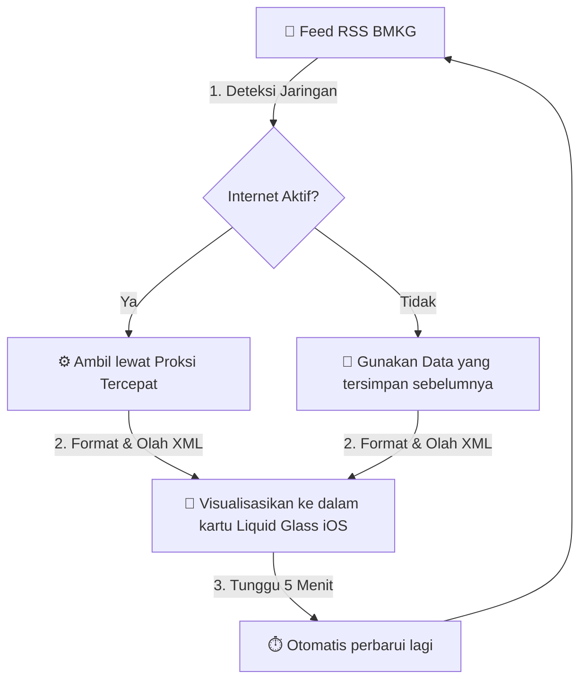

<div align="center">

# 🌩️ Peringatan Dini Cuaca BMKG — Kep. Riau

#### Pantau peringatan dini cuaca Kepulauan Riau secara real-time, langsung dari data resmi BMKG dengan desain yang mewah, ringan, cepat! 🌩️⚡

<br/>

[](https://github.com/peringatandinicuacakepri/peringatandinicuacakepri.github.io/stargazers)
&nbsp;
[](https://github.com/peringatandinicuacakepri/peringatandinicuacakepri.github.io/commits)
&nbsp;
[](LICENSE)

[](https://nowcasting.bmkg.go.id)
&nbsp;
[](https://peringatandinicuacakepri.github.io)
&nbsp;
[](https://pages.github.com)

<br/>

### 🌐 [Buka Website](https://peringatandinicuacakepri.github.io) &nbsp;•&nbsp; [✨ Fitur Unggulan](#-fitur-unggulan) &nbsp;•&nbsp; [📸 Tampilan](#-tampilan) &nbsp;•&nbsp; [🛟 FAQ & Bantuan](#-faq--bantuan) &nbsp;•&nbsp; [🚀 Mulai](#-mulai)

</div>


## 👋 Tentang Proyek Ini

Proyek ini memudahkan Anda memantau **peringatan dini cuaca ekstrem** di Kepulauan Riau secara real-time. Data diambil langsung dari server resmi BMKG, jadi informasi yang Anda lihat selalu akurat dan terkini.

Alih-alih membuka beberapa halaman BMKG yang berbeda, sekarang semua informasi penting cuaca tersedia di **satu layar yang rapi, responsif, dan cepat dimuat** bahkan di smartphone lama sekalipun.


## 📸 Tampilan Dashboard

<div align="center">

| 💎 Mode Standar (Visual Premium) | 🍃 Mode Ringan (Hemat Baterai) |
|:---:|:---:|
|  |  |
| *Efek kaca buram & animasi halus* | *Simpel & cepat untuk HP lama* |

<br/>

**🧭 Buka Lokasi Stasiun di Peta Favorit**


<br/>

**🔎 Peta Cuaca Interaktif — Zoom & Geser Bebas**

| Zoom & Geser Gambar | Informasi Terperinci |
|:---:|:---:|
|  |  |

</div>


## ✨ Fitur Unggulan

*   **📡 Data Real-Time dari BMKG:** Informasi cuaca terbaru diperbarui setiap 5 menit langsung dari server resmi BMKG untuk prakiraan 0-6 jam ke depan.

*   **⏱️ Waktu Pembaruan yang Jelas:** Lihat kapan data terakhir diperbarui (*"Baru saja"* atau *"30 menit lalu"*) dan berapa lama hingga pembaruan otomatis berikutnya.

*   **📱 Dua Mode Performa:** Pilih antara Mode Standar (visual premium dengan animasi) atau Mode Ringan (untuk hemat baterai & HP lama). Aplikasi otomatis memilih mode yang tepat sesuai perangkat Anda.

*   **🔌 Tetap Bekerja Saat Internet Mati:** Jika tidak ada koneksi internet, aplikasi otomatis menampilkan data cuaca terakhir yang tersimpan di browser Anda. Data tidak hilang!

*   **🗺️ Peta Interaktif yang Responsif:** Gambar peta cuaca bisa diperbesar, digeser, dan diputar dengan jari (touch) atau mouse. Sesuai dengan tautan yang diberikan BMKG setiap saat.

*   **🧭 Navigasi Cepat ke Lokasi:** Klik lokasi stasiun untuk langsung membuka di Google Maps, Apple Maps, Waze, atau aplikasi peta pilihan Anda.

*   **📱 Tarik Layar untuk Segarkan:** Di smartphone, cukup tarik layar ke bawah untuk memperbarui data cuaca secara instan (Pull-to-Refresh).
  
*   **🎁 Gratis & Terbuka:** Lisensi GNU GPL v3 — menjamin sumber tetap terbuka, bebas dikembangkan, aman secara hukum untuk semua orang, dan syarat setiap karya turunannya wajib menggunakan lisensi yang sama.


## ⚙️ Bagaimana Sistem Bekerja?



1. **Ambil Data:** Situs mencoba mengambil peringatan dini cuaca terbaru dari BMKG setiap 5 menit.
2. **Internet Mati?** Jika tidak ada koneksi, aplikasi otomatis menggunakan data terakhir yang tersimpan di browser.
3. **Tampilkan:** Informasi ditampilkan dalam kartu yang mewah, rapi, dan mudah dibaca.
4. **Ulang Terus:** Setiap 5 menit, situs akan memeriksa data terbaru lagi.


## 🚀 Mulai

### Cara Paling Cepat: Klik & Lihat

Tidak perlu install apa-apa! Cukup buka website di browser:

👉 **[peringatandinicuacakepri.github.io](https://peringatandinicuacakepri.github.io)**


### Jalankan di Komputer Anda Sendiri (Untuk Pemula)

Jika Anda ingin menjalankan kode ini di komputer pribadi atau ingin mengembangkannya:

## 📋 PERSIAPAN AWAL (WAJIB DIBACA PEMULA!)

Sebelum mulai, pahami istilah-istilah ini:

- **Git:** Aplikasi untuk mendownload kode dari GitHub
- **Repository:** Folder proyek di GitHub tempat semua kode disimpan
- **Clone:** Mendownload seluruh folder proyek ke komputer Anda
- **Terminal/Command Prompt:** Aplikasi untuk mengetik perintah teks
- **Index.html:** File utama aplikasi yang bisa dibuka dengan browser

---

## 🔧 LANGKAH 1: INSTALL GIT (Jika Belum Ada)

**Cek apakah Git sudah terinstall:**

Buka **Terminal** atau **Command Prompt**:
- **Windows:** Tekan `Win + R`, ketik `cmd`, tekan Enter
- **macOS:** Tekan `Cmd + Space`, ketik `terminal`, tekan Enter
- **Linux:** Buka aplikasi Terminal dari menu

Kemudian ketik:
```
git --version
```

Jika muncul versi seperti `git version 2.40.0`, berarti Git sudah terinstall. **Lanjut ke Langkah 2.**

Jika tidak ada atau error, ikuti cara install di bawah:

**Untuk Windows:**
1. Buka [git-scm.com/download/win](https://git-scm.com/download/win)
2. Klik tombol besar berwarna biru (installer akan otomatis download)
3. Jalankan file yang sudah didownload (double-click)
4. Ikuti wizard install (klik Next terus sampai selesai)
5. Restart komputer

**Untuk macOS:**
Buka Terminal dan ketik:
```
xcode-select --install
```
Tunggu proses install selesai.

**Untuk Linux (Ubuntu/Debian):**
Buka Terminal dan ketik:
```
sudo apt-get update
sudo apt-get install git
```

---

## 🔧 LANGKAH 2: DOWNLOAD KODE PROYEK (Clone dari GitHub)

Buka **Terminal** atau **Command Prompt** dan ikuti langkah ini:

**A. Pilih Lokasi Folder (Opsional tapi Disarankan)**

Buat folder khusus untuk proyek:

```bash
# Windows
mkdir projects
cd projects

# macOS / Linux
mkdir projects
cd projects
```

**Penjelasan:**
- `mkdir projects` = membuat folder baru bernama "projects"
- `cd projects` = masuk ke folder "projects"

Jika Anda tidak ingin membuat folder baru, skip langkah ini.

**B. Download (Clone) Proyek dari GitHub**

Ketik command ini di Terminal:

```bash
git clone https://github.com/peringatandinicuacakepri/peringatandinicuacakepri.github.io.git
```

**Penjelasan:**
- `git clone` = perintah untuk download
- `https://github.com/...` = link proyek di GitHub
- `.git` = menandakan ini adalah repository Git

Tunggu sampai selesai. Jika berhasil, akan muncul pesan kurang lebih:
```
Cloning into 'peringatandinicuacakepri.github.io'...
remote: Enumerating objects: 123, done.
...
Receiving objects: 100% (123/123), done.
```

**C. Masuk ke Folder Proyek**

Setelah clone selesai, masuk ke folder:

```bash
cd peringatandinicuacakepri.github.io
```

**Penjelasan:**
- Perintah ini membawa Anda ke dalam folder proyek yang baru saja didownload

**D. Lihat Isi Folder (Opsional)**

Untuk melihat file apa saja yang ada di folder:

```bash
# Di macOS / Linux
ls -la

# Di Windows
dir
```

Anda seharusnya melihat file `index.html` yang adalah file utama aplikasi.

---

## 🔧 LANGKAH 3: BUKA APLIKASI (Pilih Salah Satu Cara)

### **CARA A: PALING MUDAH (Klik Dua Kali - Tidak Perlu Terminal Lagi)**

Ini adalah cara tercepat dan paling simpel:

1. **Buka folder proyek** di komputer Anda
   - Ketik path di address bar file manager
   - Atau buka dari Terminal dengan: `explorer .` (Windows) / `open .` (macOS) / `xdg-open .` (Linux)

2. **Cari file `index.html`** di dalam folder

3. **Klik dua kali** pada file tersebut

4. **Browser akan otomatis terbuka** dengan aplikasi cuaca

**Kelebihan:**
- ✅ Sangat mudah
- ✅ Tidak perlu tahu command line
- ✅ Cocok untuk pengguna biasa

**Kekurangan:**
- ❌ Beberapa fitur mungkin terbatas atau tidak bekerja optimal (terutama untuk proxy)

---

### **CARA B: DENGAN SERVER PYTHON (RECOMMENDED)**

Cara ini paling direkomendasikan karena aplikasi bisa berfungsi 100% optimal.

**1. Cek apakah Python sudah ada:**

Di Terminal, ketik:

```bash
python --version
```

Jika muncul versi seperti `Python 3.10.5`, berarti sudah ada. **Lanjut ke step 2.**

Jika tidak ada atau error, download Python dari [python.org](https://python.org/downloads). Jangan lupa centang "Add Python to PATH" saat install.

**2. Jalankan Server:**

Pastikan Anda sudah berada di dalam folder `peringatandinicuacakepri.github.io` (lihat Langkah 2C di atas).

Kemudian ketik:

```bash
# Untuk Python 3 (yang paling banyak)
python -m http.server 8000

# Jika tidak jalan, coba:
python3 -m http.server 8000

# Untuk Windows (jika masih tidak jalan):
py -m http.server 8000
```

Jika berhasil, Anda akan melihat pesan:

```
Serving HTTP on 0.0.0.0 port 8000 (http://0.0.0.0:8000/) ...
```

**3. Buka di Browser:**

- Buka browser favorit Anda (Chrome, Firefox, Edge, Safari)
- Di address bar, ketik: `http://localhost:8000`
- Tekan Enter
- Aplikasi cuaca akan terbuka!

**4. Cara Berhenti Server:**

Di Terminal, tekan `Ctrl + C` (hold Ctrl, lalu tekan C).

**Kelebihan:**
- ✅ Aplikasi berfungsi 100% optimal
- ✅ Semua fitur bekerja dengan baik
- ✅ Proxy lebih stabil
- ✅ Cocok untuk development

---

### **CARA C: DENGAN NODE.JS (Alternatif)**

Jika Anda sudah familiar dengan Node.js atau tidak punya Python:

**1. Install Node.js:**

Download dari [nodejs.org](https://nodejs.org/). Pilih versi LTS (Long Term Support).

**2. Install http-server (Hanya Sekali):**

Di Terminal, ketik:

```bash
npm install -g http-server
```

Tunggu sampai selesai.

**3. Jalankan Server:**

Masuk ke folder proyek:

```bash
cd path/ke/peringatandinicuacakepri.github.io
```

Kemudian jalankan:

```bash
http-server
```

Server akan berjalan di `http://localhost:8080`.

**4. Buka di Browser:**

Klik link atau ketik `http://localhost:8080` di browser.

---

## 🔧 LANGKAH 4: EDIT & KEMBANGKAN (Opsional)

Jika ingin mengubah kode aplikasi:

**A. Buka File dengan Text Editor:**

Pilih salah satu editor favorit Anda:
- **Visual Studio Code** (Recommended, gratis): [code.visualstudio.com](https://code.visualstudio.com)
- **Notepad++**: [notepad-plus-plus.org](https://notepad-plus-plus.org)
- **Sublime Text**: [sublimetext.com](https://sublimetext.com)
- **Atom**: [atom.io](https://atom.io)

**B. Buka File Proyek:**

- Jalankan text editor
- File → Open Folder
- Pilih folder `peringatandinicuacakepri.github.io`
- Anda bisa lihat semua file di panel kiri

**C. Edit & Simpan:**

- Double-click file (misalnya `index.html`)
- Edit kode sesuai yang Anda inginkan
- Tekan `Ctrl + S` untuk simpan
- Refresh browser (tekan F5 atau Ctrl + R)
- Perubahan akan terlihat langsung di aplikasi

---

## 📋 RINGKASAN UNTUK PEMULA

| Pilihan | Cara | Kesulitan | Hasil |
|---------|------|-----------|-------|
| **Klik 2x** | Double-click `index.html` | Sangat Mudah ⭐ | Berfungsi Baik ✅ |
| **Python (Recommended)** | Ketik command di Terminal | Mudah ⭐⭐ | Berfungsi Optimal ✅✅ |
| **Node.js** | Install, lalu ketik command | Sedang ⭐⭐⭐ | Berfungsi Optimal ✅✅ |

**Rekomendasi untuk pemula:** Gunakan **CARA B (Python)** karena paling seimbang antara kemudahan dan hasil optimal.

---

## ❓ TROUBLESHOOTING (Jika Ada Masalah)

**Q: "command not found: git"**
A: Git belum terinstall. Ikuti Langkah 1 di atas untuk install.

**Q: "Python not found"**
A: Python belum terinstall. Download dari [python.org](https://python.org/downloads) dan pastikan centang "Add to PATH".

**Q: "Port 8000 already in use"**
A: Port sudah digunakan aplikasi lain. Gunakan port lain:
```bash
python -m http.server 9000
```
Lalu buka `http://localhost:9000`

**Q: Aplikasi buka tapi data cuaca tidak muncul**
A: Mungkin internet mati atau BMKG server down. Coba:
- Refresh browser (tekan F5)
- Tunggu beberapa saat
- Atau kunjungi [nowcasting.bmkg.go.id](https://nowcasting.bmkg.go.id) untuk cek status

**Q: "Mixed Content Error"**
A: Aplikasi sudah handle ini otomatis. Jika masih error, gunakan HTTPS:
```bash
# Buat SSL certificate (untuk pengguna advanced)
```
Atau gunakan cara klik dua kali atau Python server.

---

## ✅ SELESAI!

Sekarang Anda sudah berhasil menjalankan aplikasi cuaca di komputer pribadi! 🎉

### Personalisasi untuk Daerah Lain (Developer)

Kode aplikasi ini bisa diubah untuk daerah lain. Buka file `index.html` dan cari bagian:

```javascript
// Ubah kode stasiun dari CKR (Batam) ke stasiun BMKG lain
// Lihat daftar kode stasiun di (https://nowcasting.bmkg.go.id/infografis)
```

Setiap stasiun BMKG memiliki kode unik. Ganti kode stasiun, ubah koordinat lokasi, dan aplikasi siap untuk daerah baru!


## 🛟 FAQ & Bantuan

<details>
<summary><b>Apakah saya perlu membuat akun untuk menggunakan situs ini?</b></summary><br/>
Tidak! Situs ini gratis dan tidak butuh login atau akun apapun. Cukup buka website dan langsung bisa lihat cuaca Kepri.
</details>

<details>
<summary><b>Apakah data cuaca akurat? Dari mana sumbernya?</b></summary><br/>
Data cuaca diambil langsung dari server resmi <strong>BMKG (Badan Meteorologi, Klimatologi, dan Geofisika)</strong> — lembaga cuaca nasional Indonesia. Jadi data yang Anda lihat sama akuratnya dengan website resmi BMKG.
</details>

<details>
<summary><b>Apakah situs ini resmi dari BMKG?</b></summary><br/>
Tidak. Ini adalah proyek independen (personal) yang merapikan dan menampilkan data terbuka milik BMKG agar lebih mudah dibaca. Untuk informasi resmi, tetap kunjungi <a href="https://www.bmkg.go.id">bmkg.go.id</a>.
</details>

<details>
<summary><b>Seberapa sering data diperbarui?</b></summary><br/>
Data otomatis diperbarui setiap <strong>5 menit</strong>. Anda juga bisa menekan tombol "Segarkan" atau tarik layar ke bawah di HP untuk update instan.
</details>

<details>
<summary><b>Apa itu "Mode Ringan"? Kapan harus dipakai?</b></summary><br/>
Mode Ringan menghilangkan efek visual yang berat (blur, animasi) agar aplikasi lebih cepat dan hemat baterai. Cocok untuk HP lama atau jaringan lambat. Aplikasi otomatis memilih mode terbaik, tapi Anda bisa ganti di pengaturan.
</details>

<details>
<summary><b>Bagaimana jika internet mati?</b></summary><br/>
Tidak masalah! Aplikasi tetap menampilkan data cuaca terakhir yang tersimpan di browser Anda. Data tidak hilang. Namun data terbaru hanya bisa diambil saat ada koneksi internet.
</details>

<details>
<summary><b>Mengapa gambar peta cuaca tidak muncul?</b></summary><br/>
Jika cuaca aman dan tidak ada peringatan ekstrem, BMKG mungkin tidak merilis gambar peta baru untuk hari itu. Situs akan menampilkan status "Kondisi Aman" saja.
</details>

<details>
<summary><b>Stasiun radar sering offline atau mati?</b></summary><br/>
Bisa terjadi. Stasiun Meteorologi Hang Nadim di Batam kadang dalam pemeliharaan atau gangguan teknis. Jika terjadi, aplikasi akan menampilkan data terakhir.
</details>

<details>
<summary><b>Apakah aplikasi ini menguras kuota/baterai?</b></summary><br/>
Sangat hemat! Ukuran data yang diunduh hanya beberapa kilobyte per pembaruan. Mode Ringan juga mematikan efek visual berat untuk hemat baterai HP lama.
</details>

<details>
<summary><b>Apakah aplikasi ini melacak lokasi saya (GPS)?</b></summary><br/>
Tidak sama sekali! Aplikasi tidak pernah mengakses GPS atau lokasi pribadi Anda. Koordinat yang ditampilkan hanya alamat fisik Stasiun Meteorologi Hang Nadim (untuk membuka peta), bukan posisi tepat Anda.
</details>

<details>
<summary><b>Bisakah saya embed aplikasi ini di website sendiri?</b></summary><br/>
Tentu! Karena lisensi GNU GPL v3 (terbuka), Anda bisa gunakan tag <code>&lt;iframe&gt;</code> untuk embed di blog/website, atau clone repositori untuk host sendiri. Jangan lupa kasih kredit ya!
</details>

<details>
<summary><b>Bisakah saya ubah untuk daerah lain selain Kepri?</b></summary><br/>
Tentu bisa! Kode aplikasi modular dan bisa diubah. Ganti kode stasiun BMKG, ubah koordinat, dan judul — aplikasi siap untuk daerah baru. Lihat bagian "Personalisasi untuk Daerah Lain" di atas.
</details>

<details>
<summary><b>Apakah aplikasi ini memerlukan "API Key" atau kunci akses khusus?</b></summary><br/>
Tidak perlu! Data BMKG gratis dan terbuka untuk publik. Tidak seperti layanan cuaca berbayar (OpenWeatherMap, dsb) yang butuh API Key, proyek ini langsung ambil data dari server BMKG tanpa perlu registrasi apapun.
</details>

<details>
<summary><b>Gambar dari server BMKG blokir (Mixed Content error)?</b></summary><br/>
Aplikasi sudah dilengkapi sistem otomatis yang mengubah link `http://` menjadi `https://` agar tidak diblokir browser. Jadi Anda tidak perlu khawatir.
</details>

<details>
<summary><b>Saya error saat clone, apa yang harus dilakukan?</b></summary><br/>
Pastikan Git sudah terinstall dengan benar. Ketik `git --version` di terminal untuk cek. Jika tidak terinstall, download dari <a href="https://git-scm.com">git-scm.com</a>. Jika masih error, coba download file sebagai ZIP dari GitHub: klik tombol "Code" (hijau) → pilih "Download ZIP".
</details>

<details>
<summary><b>Server Python tidak jalan, kenapa?</b></summary><br/>
Pastikan Python sudah terinstall. Ketik `python --version` di terminal untuk cek. Jika tidak, download dari <a href="https://www.python.org/downloads">python.org</a>. Jika sudah terinstall tapi masih error, coba `python3 -m http.server 8000` atau gunakan Node.js sebagai alternatif.
</details>


## 📊 Sumber Data & Referensi

| Penyedia | Keterangan | Link |
|:---|:---|:---|
| **BMKG Nowcasting** | Sumber data resmi pemerintah Indonesia untuk peringatan dini cuaca dan nowcasting real-time (0 sampai 6 jam ke depan)  | [Nowcasting BMKG](https://nowcasting.bmkg.go.id/nowcast) |
| **BMKG Alerts RSS** | Feed peringatan cuaca nasional (format XML) | [Alert RSS XML](https://www.bmkg.go.id/alerts/nowcast/id/rss.xml) |
| **Infografis BMKG** | Direktori publik yang menampung aset file berupa gambar dan lain-lain tentang peringatan cuaca dari seluruh stasiun radar BMKG di Indonesia | [Infografis](https://nowcasting.bmkg.go.id/infografis/) |
| **Google Fonts** | Layanan tipografi web dan aset antarmuka untuk desain dan pengembangan web dari Google | [fonts.google.com](https://fonts.google.com) |
| **Proxy Services** | Layanan Proksi CORS gratis untuk mengambil data situs web via JavaScript tanpa hambatan keamanan browser | [AllOrigins](https://allorigins.win) / [CORSProxy](https://corsproxy.io) |

**Koordinat Stasiun:** Stasiun Meteorologi Hang Nadim terletak di Batam, Kepulauan Riau — `1.119590, 104.113316`

> ⚠️ **Hak Cipta:** Seluruh data cuaca dan infografis adalah hak cipta © **BMKG Indonesia**. Aplikasi ini hanya menampilkan kembali data publik terbuka BMKG secara non-komersial.


## 🛠️ Teknologi yang Digunakan

<div align="center">


&nbsp;

&nbsp;


</div>

Aplikasi ini dibangun murni dengan **HTML5**, **CSS3**, dan **JavaScript Vanilla** (tanpa framework). Artinya:
- ✅ Tidak ada file besar yang perlu diunduh
- ✅ Halaman muat sangat cepat
- ✅ Cocok untuk internet lambat
- ✅ Hemat memori di HP lama


## 🤝 Kontribusi & Dukungan

Menemukan bug? Punya saran fitur? Punya ide untuk perbaikan?

👉 **[Buka Issue di GitHub](https://github.com/peringatandinicuacakepri/peringatandinicuacakepri.github.io/issues)** untuk laporkan masalah atau usulkan fitur baru.

### Berikan Bintang ⭐

Jika proyek ini membantu Anda, dukungan Anda berupa bintang (⭐) di repositori ini akan sangat memotivasi saya selaku pengembang. Terima kasih banyak atas dukungan Anda!


<div align="center">

Dibuat dengan 💟 oleh **Jeremi Totti Manalu**

*Berbagi informasi cuaca akurat untuk keselamatan bersama.*

</div>
