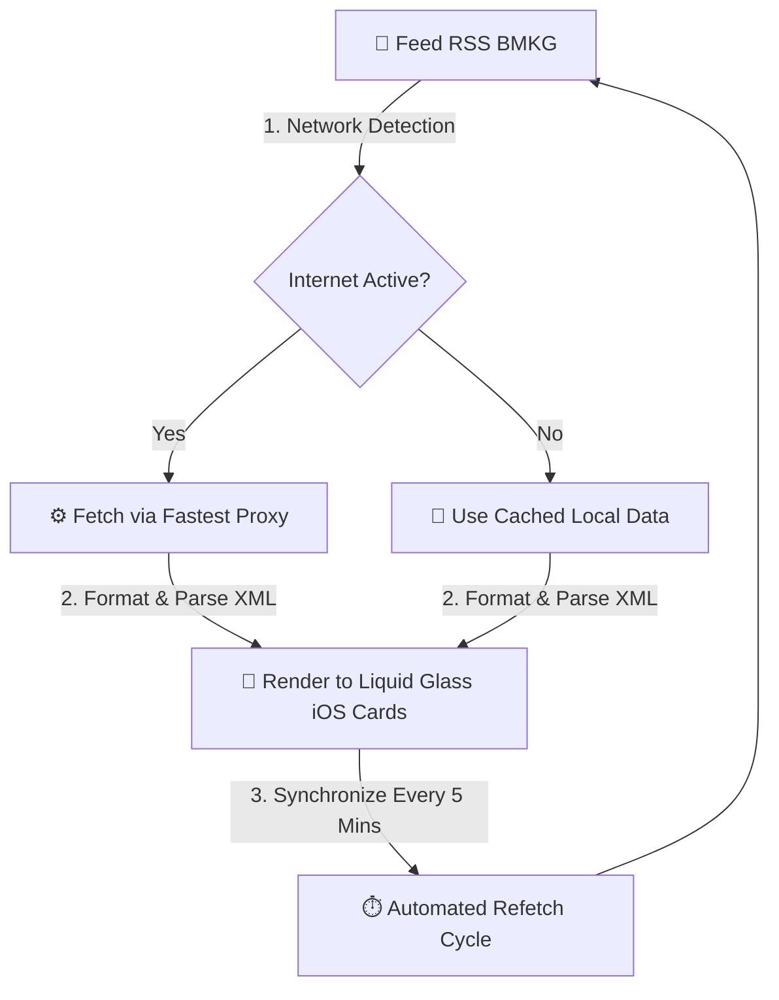
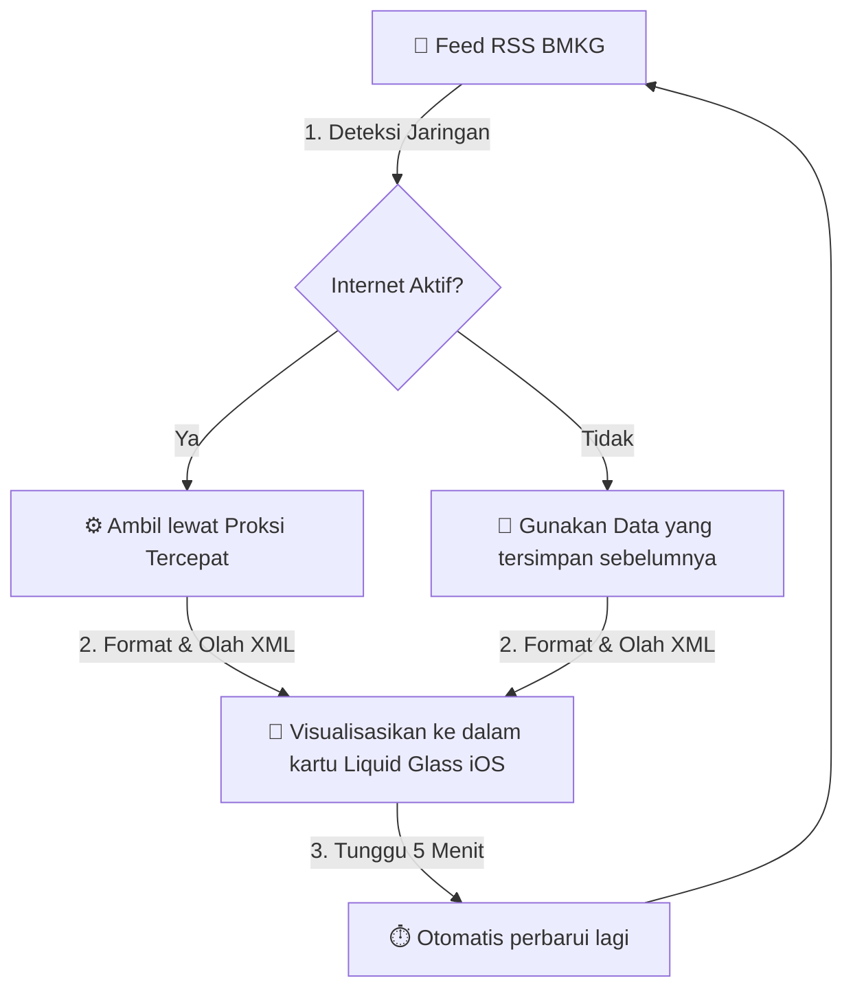

<div align="center">
  
# 🌤 Peringatan Dini Cuaca BMKG: Kep. Riau 🌩️

#### Pantau peringatan dini cuaca Kepulauan Riau secara real-time, langsung dari data resmi BMKG dengan desain yang mewah, ringan, cepat! 🌩️⚡

<br/>

[](https://github.com/peringatandinicuacakepri/peringatandinicuacakepri.github.io/stargazers)
&nbsp;
[](https://github.com/peringatandinicuacakepri/peringatandinicuacakepri.github.io/commits)
&nbsp;
[](LICENSE)

[](https://nowcasting.bmkg.go.id)
&nbsp;
[](https://peringatandinicuacakepri.github.io)
&nbsp;
[](https://pages.github.com)

<br/>

</div>


## 🌐 Navigation / Navigasi
- [🇬🇧 English Version](#english-version)
- [🇮🇩 Versi Bahasa Indonesia](#versi-bahasa-indonesia)


<a id="english-version"></a>
# 🇬🇧 English Version

## 📋 Table of Contents
* [👋 About the Project](#en-about)
* [📸 Dashboard Preview](#en-preview)
* [✨ Key Features](#en-features)
* [⚙️ How the System Works](#en-how-it-works)
* [🌐 Technical Challenge: Getting Around CORS](#en-cors)
* [🚀 Quick Start](#en-quick-start)
  * [The Fastest Way: Click & View](#en-click-view)
  * [Running the Project Locally (For Beginners)](#en-run-locally)
* [📋 Initial Preparation](#en-preparation)
* [🔧 Step 1: Install Git](#en-step1)
* [🔧 Step 2: Download the Project](#en-step2)
* [🔧 Step 3: Open the Website](#en-step3)
  * [Method A: Double-Click (Easiest)](#en-step3a)
  * [Method B: Python Server (Recommended)](#en-step3b)
  * [Method C: Node.js (Alternative)](#en-step3c)
* [🔧 Step 4: Edit & Develop](#en-step4)
* [📋 Summary for Beginners](#en-summary)
* [❓ Troubleshooting](#en-troubleshooting)
* [✅ Done!](#en-done)
  * [Personalize for Another Region (Developers)](#en-personalize)
* [🛟 FAQ & Support](#en-faq)
* [📊 Data Sources & References](#en-sources)
* [📁 Project Structure](#en-structure)
* [🛠️ Technologies Used](#en-tech)
* [🔒 Privacy](#en-privacy)
* [🤝 Contribution & Support](#en-contribute)
  * [Leave a Star ⭐](#en-star)

---

<a id="en-about"></a>
## 👋 About the Project
This open-source project facilitates the real-time monitoring of extreme weather alerts across the Riau Islands. The application retrieves metadata and infographical assets directly from the official BMKG server, ensuring that the displayed parameters are consistently reliable, authoritative, and timely.

Rather than forcing users to navigate multiple disparate government pages, all critical meteorological telemetry is consolidated into a single, highly responsive, and lightweight user interface. The system loads instantaneously and performs exceptionally well on legacy hardware and low-bandwidth connections.

---

<a id="en-preview"></a>
## 📸 Dashboard Preview

<div align="center">

| 💎 Standard Mode (Premium Visuals) | 🍃 Light Mode (Optimized & Battery-Friendly) |
|:---:|:---:|
|  |  |
| *Frosted glass effects & subtle animations* | *Simple & optimized for legacy mobile devices* |

<br/>

**🧭 Open Station Location on Your Preferred Map Application**


<br/>

**🔎 Interactive Weather Map with Zoom and Pan Support**

| Gesture-Controlled Zoom & Pan | Detailed Weather Information |
|:---:|:---:|
|  |  |

</div>

---

<a id="en-features"></a>
## ✨ Key Features

| Feature | Description |
| --- | --- |
| 📡 **Real-Time BMKG Data** | Current meteorological warnings updated every 5 minutes directly from the official BMKG server, forecasting conditions 0 to 6 hours ahead |
| ⏱️ **Clear Update Timestamps** | Tracks exactly when data was last synchronized and provides a visual countdown timer to the next automated update |
| 📱 **Dual Visual Modes** | Seamlessly alternates between Standard Mode (with premium frosted-glass cards) and Light Mode (which disables resource-intensive animations for legacy hardware) |
| 🔌 **Offline Resiliency** | Automatically serves cached meteorological data in the event of local connectivity issues, preventing application failure |
| 🗺️ **Interactive Radar Map** | Allows users to scale, shift, and inspect the official weather radar imagery with native pan-and-zoom controls |
| 🔍 **Open in Maps** | Resolves the exact geospatial coordinates of the Hang Nadim Meteorological Station to your preferred mapping client |
| 🎨 **Liquid Glass UI** | A modern user interface utilizing polished CSS backdrop filters, mirroring the visual aesthetics of contemporary iOS card designs |
| 🔗 **Authoritative Backlinks** | Direct hyperlinks to original government resources, maintaining data lineage and verifiability |
| 🎁 **Free & Open Source** | Licensed under GNU GPL v3, which ensures that the codebase remains open, free, legally compliant, and mandates that all derivative projects adopt the identical license structure |
| ⚡ **Highly Performant** | Engineered with pure HTML5, CSS3, and modern Vanilla JavaScript without any dependency on heavy modern frameworks |

---

<a id="en-how-it-works"></a>
## ⚙️ How the System Works



1. **Telemetry Retrieval:** The web application attempts to fetch the latest weather alerts from BMKG every 5 minutes.
2. **Offline Fallback:** If local connectivity is absent, the client application loads the last successful dataset saved within the browser cache.
3. **Data Rendering:** The parsed meteorological XML payload is styled and rendered into elegant frosted-glass cards.
4. **Automated Synchronization:** A background worker runs every 300 seconds to initiate subsequent update loops.

---

<a id="en-cors"></a>
## 🌐 Technical Challenge: Getting Around CORS

### 1. The CORS Block and What It Breaks
When developing client-side web applications that consume public data, developers frequently encounter the restrictive mechanism known as **Cross-Origin Resource Sharing (CORS)**. In this project, the core functionality relies on retrieving real-time weather warning data directly from the official BMKG server (`nowcasting.bmkg.go.id`). However, because the application is hosted on GitHub Pages (`peringatandinicuacakepri.github.io`), any client-side asynchronous HTTP request (such as via the `fetch` API or `XMLHttpRequest`) initiated from our origin to the BMKG domain is categorized as a cross-origin request.

By default, the browser's **Same-Origin Policy (SOP)**, which is a fundamental security pillar designed to prevent malicious websites from reading sensitive data from other origins, intervenes. If the destination server does not explicitly return the `Access-Control-Allow-Origin` header indicating that our origin is permitted to access the resource, the browser immediately blocks the response payload. Because the official BMKG server does not append this permissive CORS header, direct web requests from our client-side application fail consistently, throwing a console error:

`Access to fetch at 'https://nowcasting.bmkg.go.id/nowcast...' from origin 'https://peringatandinicuacakepri.github.io' has been blocked by CORS policy: No 'Access-Control-Allow-Origin' header is present on the requested resource.`

### Impact on User Experience (UX)
If left unmitigated, this security constraint has a catastrophic impact on user experience:
* **Inoperable Dashboard:** The core value proposition of the app is to deliver real-time meteorological warnings. Without data access, the application is rendered completely inert, displaying blank containers and broken visual components.
* **Perpetual Loading States:** Users are greeted by infinite loading spinners or frozen interfaces, leading to frustration and the false assumption that their internet connection is faulty.
* **Erosion of User Trust:** In emergency situations where rapid access to weather warnings is vital, a non-responsive dashboard severely undermines the credibility of the platform.

---

### 2. The Options, and How the Proxy Solves It
Three ways around the CORS block were considered:

| Solution | Implementation Complexity | Financial Cost | Performance & Latency | Architectural Pros & Cons |
| :--- | :--- | :--- | :--- | :--- |
| **Direct Fetch (Standard Client-Side)** | None | Zero | Optimal (if it worked) | **Pros:** Direct client-to-server connection; minimal latency.<br>**Cons:** Structurally blocked by browser security policies; completely unviable here. |
| **Self-Hosted Proxy Backend** *(e.g., Express.js, Go, or Serverless Functions)* | High | Variable (Hosting fees for servers/cloud workers) | Moderate-to-Fast | **Pros:** Complete control over headers, payload caching, and request rate-limiting; enhanced privacy.<br>**Cons:** Introduces server maintenance overhead; destroys the purely static, zero-cost architecture of GitHub Pages. |
| **Third-Party CORS Proxies** *(e.g., AllOrigins, CORSProxy.io)* | Extremely Low (Client-side implementation) | Zero (Free-tier services) | Moderate (Dependent on proxy server location) | **Pros:** Zero configuration; preserves the serverless nature of our deployment; bypasses browser-level CORS completely.<br>**Cons:** Introduces a single point of failure (third-party uptime); slight latency overhead due to proxy redirection. |

#### How the Proxy Solves It
A proxy service such as **AllOrigins** or **CORSProxy.io** uses the gap between the browser environment and the server environment:

1. **Rewrite the URL:** instead of calling `fetch()` on the BMKG URL, the app wraps it in the proxy's URL, for example `https://api.allorigins.win/raw?url=https://nowcasting.bmkg.go.id/nowcast/...`
2. **Browser talks to the proxy:** the browser sends the request to AllOrigins, which does return CORS headers, so the browser allows it.
3. **Proxy talks to BMKG:** AllOrigins makes a plain HTTP request to the BMKG server. That happens server-to-server, outside any browser, so the Same-Origin Policy does not apply and the XML comes back without a block.
4. **Proxy returns the data:** AllOrigins sends the payload back to the user's browser with `Access-Control-Allow-Origin: *` attached.
5. **Browser accepts it:** with that header present, the site's JavaScript can read the response and render the weather cards.

### 3. Data Security and Information Integrity
Using a third party is safe here for two reasons:
* **The data is public:** BMKG early warning data needs no authentication, API key, or credentials. No personal data or secret key ever passes through the proxy.
* **Dynamic failover:** if one proxy goes down or times out, the app switches to another. The code tries AllOrigins first, then falls back to CORSProxy.io and other backups, so a single outage does not take the dashboard offline.

### 4. Why This Option Was Chosen
This is an open-source project with no budget, so running a server was not sustainable. Public CORS proxies keep the site fully static, serverless, and free to host while still delivering the BMKG feed. The failover logic covers the main weakness of depending on someone else's uptime.

---

<a id="en-quick-start"></a>
## 🚀 Quick Start

<a id="en-click-view"></a>
### The Fastest Way: Click & View
No manual setup is required! Simply launch the application via your favorite web browser:
👉 **[peringatandinicuacakepri.github.io](https://peringatandinicuacakepri.github.io)**

<a id="en-run-locally"></a>
### Running the Project Locally (For Beginners)
If you wish to host the dashboard locally or inspect the source files, please follow the steps below.

---

<a id="en-preparation"></a>
## 📋 Initial Preparation
Before you begin, make sure you understand the following concepts:
- **Git:** A tool used to download code from GitHub and manage version control.
- **Repository:** The folder on GitHub where all the project files are kept.
- **Clone:** The process of downloading the entire repository from GitHub to your computer.
- **Terminal/Command Prompt:** A program used to run text-based commands.
- **index.html:** The main file of the website that opens in your browser.

---

<a id="en-step1"></a>
## 🔧 Step 1: Install Git (If Not Already Installed)
Verify if Git is installed by opening your Terminal or Command Prompt and typing:
```bash
git --version
```
If this command returns a version number (such as `git version 2.40.0`), you may skip to Step 2.
Otherwise, install Git depending on your operating system:
- **Windows:** Download the installer from [git-scm.com/download/win](https://git-scm.com/download/win) and run the setup wizard.
- **macOS:** Open the Terminal and run `xcode-select --install`.
- **Linux:** Run `sudo apt-get update && sudo apt-get install git`.

---

<a id="en-step2"></a>
## 🔧 Step 2: Download the Project (Clone from GitHub)
Open your Terminal or Command Prompt and execute the following commands:
1. **Choose a Directory (Optional but Recommended)**:
   ```bash
   mkdir projects
   cd projects
   ```
2. **Download (Clone) the Repository**:
   ```bash
   git clone https://github.com/peringatandinicuacakepri/peringatandinicuacakepri.github.io.git
   ```
3. **Navigate Into the Project Folder**:
   ```bash
   cd peringatandinicuacakepri.github.io
   ```

---

<a id="en-step3"></a>
## 🔧 Step 3: Open the Website (Choose One Method)

<a id="en-step3a"></a>
### Method A: Direct Double-Click (Easiest Method)
1. Open your file explorer and locate the downloaded project folder.
2. Search for the `index.html` file.
3. Double-click the file to open it in your browser.
- **Pros:** Completely visual, no terminal commands required.
- **Cons:** Browser security policies might limit proxy connections in local file environments.

<a id="en-step3b"></a>
### Method B: Local Python Server (Recommended)
1. Verify Python is installed by running `python --version` or `python3 --version`. If it is not installed, download it from [python.org](https://python.org).
2. Inside your terminal, make sure you are in the project folder and run:
   ```bash
   python -m http.server 8000
   ```
3. Open your browser and navigate to `http://localhost:8000`.
- **Pros:** Highly stable and matches production behavior perfectly.

<a id="en-step3c"></a>
### Method C: Node.js (Alternative)
1. Download and install Node.js from [nodejs.org](https://nodejs.org).
2. Install the lightweight local server package globally:
   ```bash
   npm install -g http-server
   ```
3. Launch the server in the project directory:
   ```bash
   http-server
   ```
4. Access the site via your browser at `http://localhost:8080`.

---

<a id="en-step4"></a>
## 🔧 Step 4: Edit & Develop (Optional)
If you wish to customize the dashboard:
1. Open the project folder in an editor such as **Visual Studio Code**, **Notepad++**, or **Sublime Text**.
2. Make your edits to `index.html`.
3. Save the file with `Ctrl + S`, and refresh your browser page to view the updates immediately.

---

<a id="en-summary"></a>
## 📋 Summary for Beginners
| Option | Method | Difficulty | Result |
| :--- | :--- | :--- | :--- |
| **Direct Double-Click** | Open `index.html` directly | Very Easy | Functions Well |
| **Python Server** | Run command in Terminal | Easy | Optimal Functionality |
| **Node.js** | Install, then run command | Moderate | Optimal Functionality |

---

<a id="en-troubleshooting"></a>
## ❓ Troubleshooting
* **Error: "command not found: git"**: Git is not installed. Follow the instructions in Step 1.
* **Error: "Python not found"**: Python is missing or not configured. Ensure "Add Python to PATH" is checked during Python installation.
* **Error: "Port 8000 already in use"**: Another application is using port 8000. Launch the server on another port using `python -m http.server 9000` and navigate to `http://localhost:9000`.
* **Dashboard displays no weather data**: Check your internet connection. Alternatively, the BMKG server might be temporarily offline.

---

<a id="en-done"></a>
## ✅ Done!

You have now run the weather site on your own computer! 🎉

<a id="en-personalize"></a>
### Personalize for Another Region (Developers)

The code can be adapted for other regions. Open `index.html` and find this section:

```javascript
// Change the station code from CKR (Batam) to another BMKG station
// See the list of station codes at (https://nowcasting.bmkg.go.id/infografis)
```

Every BMKG station has a unique code. Change the station code, adjust the coordinates (optional), and the site is ready for a new region.

---

<a id="en-faq"></a>
## 🛟 FAQ & Support
<details> <summary><b>Do I need an account to use this website?</b></summary><br/> No. The site is free and needs no login or account. Open it and you can see the Kepri weather straight away. </details>
<details> <summary><b>Is the weather data accurate? Where does it come from?</b></summary><br/> The data is fetched directly from the official server of <strong>BMKG (Badan Meteorologi, Klimatologi, dan Geofisika)</strong>, Indonesia's national weather agency. What you see here is as accurate as the official BMKG website. </details>
<details> <summary><b>Is this an official BMKG application?</b></summary><br/> No. This is an independent, personal project that tidies up and displays BMKG's open data so it is easier to read and nicer to look at. For official information, always visit <a href="https://www.bmkg.go.id">bmkg.go.id</a>. </details>
<details> <summary><b>How often is the data updated?</b></summary><br/> Automatically every <strong>5 minutes</strong>. You can also pull the screen down from the top for an instant update. </details>
<details> <summary><b>What is "Light Mode", and when should I use it?</b></summary><br/> Light Mode removes heavy visual effects (blur, animations) so the site runs faster and uses less battery. It suits older phones and slow connections. The site picks the best mode automatically, but you can switch it yourself at any time. </details>
<details> <summary><b>What happens when my internet drops?</b></summary><br/> No problem. The site keeps showing the last weather data stored in your browser, so nothing is lost. New data can only be fetched once you are back online. </details>
<details> <summary><b>Why is the weather map image missing?</b></summary><br/> When conditions are calm and there is no extreme warning, BMKG may not publish a new map image for that day. The site then shows a "Safe Condition" status instead. </details>
<details> <summary><b>Does the radar station go offline often?</b></summary><br/> It can happen. The Hang Nadim Meteorological Station in Batam is sometimes under maintenance or hit by a technical fault. When that happens, the site shows the last data it received. </details>
<details> <summary><b>Does this site drain my data allowance or battery?</b></summary><br/> It is very light. Each update downloads only a few kilobytes. Light Mode also turns off the heavy visual effects to save battery on older phones. </details>
<details> <summary><b>Does this site track my location (GPS)?</b></summary><br/> Not at all. The site never reads your GPS or personal location. The coordinates it shows are the physical address of the Hang Nadim Meteorological Station, used by the "open in maps" button, not your position. </details>
<details> <summary><b>Can I embed this site on my own website?</b></summary><br/> Yes. The GNU GPL v3 license is open, so you can embed it with an <code>&lt;iframe&gt;</code> tag on your blog or website, or clone the repository and host it yourself. Please keep the credit. </details>
<details> <summary><b>Can I adapt it for a region other than Kepri?</b></summary><br/> Yes. The code is modular. Change the BMKG station code, the coordinates, and the title, and the app is ready for a new region. See "Personalize for Another Region" above. </details>
<details> <summary><b>Does this site need an API key or special access?</b></summary><br/> No. BMKG data is free and open to the public. Unlike paid weather services such as OpenWeatherMap that require an API key, this project reads BMKG's servers directly with no registration. </details>
<details> <summary><b>I got an error while cloning. What should I do?</b></summary><br/> Check that Git is installed correctly by typing `git --version` in your terminal. If it is missing, download it from <a href="https://git-scm.com">git-scm.com</a>. If it still fails, download the project as a ZIP from GitHub instead: click the green "Code" button, then "Download ZIP". </details>
<details> <summary><b>The Python server will not start. Why?</b></summary><br/> Make sure Python is installed by typing `python --version` in your terminal. If it is missing, download it from <a href="https://www.python.org/downloads">python.org</a>. If Python is installed but you still get an error, try `python3 -m http.server 8000`, or use Node.js instead. </details>
<details> <summary><b>Is there a mobile app (APK)?</b></summary><br/> Not on the Play Store or App Store yet. The site is responsive and works well on a phone browser, so you can open it in Chrome (Android) or Safari (iOS) and add it to your home screen from the browser's Share menu. It then behaves like an app, though it still needs a connection to fetch new data. </details>
<details> <summary><b>May I use this project for study or a final-year assignment?</b></summary><br/> Of course. The project is <i>open source</i>. You are welcome to use it as a reference, for coursework, or in your portfolio, as long as you follow the GNU GPL v3 license and credit the original source. </details>
<details> <summary><b>Why does the weather here sometimes differ from the weather app on my phone (AccuWeather, The Weather Channel)?</b></summary><br/> Global apps usually rely on global forecast models, which can be less accurate at local scale. This site reads <strong>real-time radar and nowcasting</strong> data from the local BMKG station in the Riau Islands, so it tends to be more accurate for current conditions (0 to 6 hours ahead) in this area. </details>

<a id="en-sources"></a>
## 📊 Data Sources & References

| Provider | Description | Link |
|:---|:---|:---|
| **BMKG Nowcasting** | The Indonesian government's official source for early weather warnings and real-time nowcasting (0 to 6 hours ahead) | [Nowcasting BMKG](https://nowcasting.bmkg.go.id/nowcast) |
| **BMKG Alerts RSS** | National weather alert feed (XML format) | [Alert RSS XML](https://www.bmkg.go.id/alerts/nowcast/id/rss.xml) |
| **BMKG Infografis** | Public directory holding the image assets for weather warnings from every BMKG radar station in Indonesia | [Infografis](https://nowcasting.bmkg.go.id/infografis/) |
| **Google Fonts** | Google's web typography service, used for the interface typefaces | [fonts.google.com](https://fonts.google.com) |
| **Proxy Services** | Free CORS proxy services that fetch site data for JavaScript without tripping the browser's security block | [AllOrigins](https://allorigins.win) / [CORSProxy](https://corsproxy.io) |

**Station coordinates:** The Hang Nadim Meteorological Station is in Batam, Riau Islands (coordinates: `1.119590, 104.113316`)

> ⚠️ **Copyright:** All weather data and infographics are copyright © **BMKG Indonesia**. This site only republishes BMKG's open public data, non-commercially.

---

<a id="en-structure"></a>
## 📁 Project Structure
```
peringatandinicuacakepri.github.io/
│
├── screenshots/        # Screenshots used in this README
├── LICENSE             # License for this GitHub project (GNU GPL v3)
├── README.md           # Documentation (you are here)
└── index.html          # The main site (a single standalone file holding all the code)
```

---

<a id="en-tech"></a>
## 🛠️ Technologies Used
<div align="center">


&nbsp;

&nbsp;


</div>

> Built with no external dependencies, which keeps it portable and light.

---

<a id="en-privacy"></a>
## 🔒 Privacy
* No user data is EVER collected or sent to external servers controlled by this project.
* All API requests ARE initiated locally from your web browser to the BMKG server.
* The application does NOT access your physical location (GPS coordinates)
* Data kept in your browser (cache) exists only for offline mode and is NEVER sent anywhere

---

<a id="en-contribute"></a>
## 🤝 Contribution & Support

Found a bug? Have a feature idea? Or a suggestion for an improvement?

👉 **[Open an Issue on GitHub](https://github.com/peringatandinicuacakepri/peringatandinicuacakepri.github.io/issues)** to report a problem or propose a new feature.

<a id="en-star"></a>
### Leave a Star ⭐

If this project helps you, a star (⭐) on the repository is a big motivation for me as the developer. Thank you for the support!


<a id="versi-bahasa-indonesia"></a>
# 🇮🇩 Versi Bahasa Indonesia

## 📋 Daftar Isi
* [👋 Tentang Proyek Ini](#id-about)
* [📸 Tampilan Dashboard](#id-preview)
* [✨ Fitur Unggulan](#id-features)
* [⚙️ Bagaimana Sistemnya Bekerja?](#id-how-it-works)
* [🛡️ Solusi Teknis: Mengatasi Masalah CORS dengan Proxy Pihak Ketiga](#id-cors)
* [🚀 Mulai](#id-quick-start)
  * [Cara Paling Cepat: Klik & Lihat](#id-click-view)
  * [Jalankan di Komputer Anda Sendiri (Untuk Pemula)](#id-run-locally)
* [📋 Persiapan Awal (Wajib Dibaca Pemula!)](#id-preparation)
* [🔧 Langkah 1: Install Git](#id-step1)
* [🔧 Langkah 2: Download Kode Proyek](#id-step2)
* [🔧 Langkah 3: Buka Situs](#id-step3)
  * [Cara A: Paling Mudah](#id-step3a)
  * [Cara B: Server Python (Disarankan)](#id-step3b)
  * [Cara C: Node.js (Alternatif)](#id-step3c)
* [🔧 Langkah 4: Edit & Kembangkan](#id-step4)
* [📋 Ringkasan Untuk Pemula](#id-summary)
* [❓ Troubleshooting](#id-troubleshooting)
* [✅ Selesai!](#id-done)
  * [Personalisasi untuk Daerah Lain (Developer)](#id-personalize)
* [❓ FAQ & Bantuan](#id-faq)
* [📊 Sumber Data & Referensi](#id-sources)
* [📁 Struktur Proyek](#id-structure)
* [🛠️ Teknologi yang Digunakan](#id-tech)
* [🔒 Privasi](#id-privacy)
* [🤝 Kontribusi & Dukungan](#id-contribute)
  * [Berikan Bintang ⭐](#id-star)

---

<a id="id-about"></a>
## 👋 Tentang Proyek Ini

Proyek ini memudahkan Anda memantau **peringatan dini cuaca ekstrem** di Kepulauan Riau secara real-time. Data diambil langsung dari server resmi BMKG, jadi informasi yang Anda lihat selalu akurat dan terkini.

Alih-alih membuka beberapa halaman BMKG yang berbeda, sekarang semua informasi penting cuaca tersedia di **satu layar yang rapi, responsif, dan cepat dimuat** bahkan di perangkat lama sekalipun.

---

<a id="id-preview"></a>
## 📸 Tampilan Dashboard

<div align="center">

| 💎 Mode Standar (Visual Premium) | 🍃 Mode Ringan (Visual dibatasi supaya ringan) |
|:---:|:---:|
|  |  |
| *Efek kaca buram & animasi halus* | *Simpel & cepat untuk HP lama* |

<br/>

**🧭 Buka Lokasi Stasiun di Peta Favorit**


<br/>

**🔎 Peta Cuaca Interaktif: Zoom & Geser Bebas**

| Zoom & Geser Gambar | Informasi Terperinci |
|:---:|:---:|
|  |  |

</div>

---

<a id="id-features"></a>
## ✨ Fitur Unggulan

| Fitur | Deskripsi |
| --- | --- |
| 📡 **Data Real-Time BMKG** | Informasi cuaca terkini diperbarui setiap 5 menit langsung dari server resmi BMKG untuk prakiraan 0-6 jam ke depan |
| ⏱️ **Waktu Pembaruan Jelas** | Lihat kapan data terakhir diperbarui dan hitung mundur ke pembaruan berikutnya |
| 📱 **Dua Mode** | Mode Standar (visual premium) atau Mode Ringan (hemat baterai & HP lama) yang otomatis menyesuaikan dengan perangkat|
| 🔌 **Offline Mode** | Tetap menampilkan data cuaca terakhir meskipun internet mati berdasarkan data yang tersimpan di browser sebelumnya |
| 🗺️ **Peta Interaktif** | Gambar peta cuaca bisa diperbesar dan digeser dengan sentuhan atau mouse |
| 🔍 **Buka di Peta** | Lihat lokasi stasiun radar BMKG Hang Nadim di peta favorit Anda |
| 🎨 **Liquid Glass UI** | Desain kartu modern ala iOS dengan efek kaca buram yang elegan nan mewah|
| 🔗 **Sumber Resmi** | Tautan langsung ke BMKG dan sumber data resmi lainnya |
| 🎁 **Gratis & Terbuka** | Lisensi GNU GPL v3 yang menjamin sumber kode tetap terbuka, bebas dikembangkan, aman secara hukum untuk semua orang, dan syarat setiap karya turunannya wajib menggunakan lisensi yang sama. |
| ⚡ **Ringan & Cepat** | Hanya HTML, CSS, dan JavaScript Vanilla tanpa framework yang dimuat secara instan |

---

<a id="id-how-it-works"></a>
## ⚙️ Bagaimana Sistemnya Bekerja?



1. **Ambil Data:** Situs mencoba mengambil peringatan dini cuaca terbaru dari BMKG setiap 5 menit.
2. **Internet Mati?** Jika tidak ada koneksi, situs otomatis menggunakan data terakhir yang tersimpan di browser.
3. **Tampilkan:** Informasi ditampilkan dalam kartu yang mewah, rapi, dan mudah dibaca.
4. **Ulang Terus:** Setiap 5 menit, situs akan memeriksa data terbaru lagi.

---

<a id="id-cors"></a>
## 🛡️ Solusi Teknis: Mengatasi Masalah CORS dengan Proxy Pihak Ketiga

### 1. Memahami Aspek Keamanan Web dan Keterbatasan Browser
Dalam arsitektur web modern, terdapat protokol keamanan mendasar yang diterapkan oleh semua peramban (browser) modern yang dikenal sebagai **Kebijakan Asal Usul yang Sama (Same-Origin Policy atau SOP)**. Protokol ini dirancang demi keamanan pengguna, yaitu untuk memastikan bahwa skrip jahat dari suatu situs web tidak dapat membaca data sensitif dari situs web lain tanpa izin eksplisit.

SOP membatasi bagaimana dokumen atau skrip yang dimuat dari satu *origin* (kombinasi protokol, domain, dan port) dapat berinteraksi dengan sumber daya dari *origin* lain. Dalam konteks proyek ini:
* **Origin Aplikasi:** `https://peringatandinicuacakepri.github.io` (GitHub Pages)
* **Origin Target:** `https://nowcasting.bmkg.go.id` atau `https://www.bmkg.go.id` (Server BMKG)

Karena kedua alamat tersebut memiliki domain yang berbeda, peramban akan mengategorikan setiap permintaan data sebagai permintaan lintas asal (*cross-origin request*). Jika server BMKG tidak mengirimkan kepala respons (*response headers*) bernama `Access-Control-Allow-Origin` yang mengizinkan domain kita (atau tanda bintang `*` untuk semua domain), peramban akan memblokir respons tersebut demi alasan keamanan.

Penting untuk dipahami bahwa hambatan CORS ini **hanya terjadi di tingkat peramban (browser)**. Jika permintaan data dilakukan dari lingkungan non-browser (seperti menggunakan cURL, Postman, atau aplikasi server-side), hambatan CORS ini tidak akan berlaku karena lingkungan tersebut tidak mengimplementasikan Same-Origin Policy.

---

### 2. Bagaimana AllOrigins dan CORSProxy Mengatasi Hambatan Ini
Layanan proksi CORS pihak ketiga seperti **AllOrigins** dan **CORSProxy.io** memanfaatkan celah perbedaan antara lingkungan peramban dan server-side ini untuk menyediakan solusi yang elegan tanpa memerlukan server backend mandiri.

Alur kerja solusi ini adalah sebagai berikut:
1. **Penyusunan URL:** Alih-alih melakukan `fetch()` langsung ke URL server BMKG, aplikasi membungkus URL target tersebut ke dalam URL milik layanan proksi. Contohnya:
   `https://api.allorigins.win/raw?url=https://nowcasting.bmkg.go.id/nowcast/...`
2. **Komunikasi Server-ke-Server:** Peramban mengirimkan permintaan ke server AllOrigins. Karena server AllOrigins telah dikonfigurasi untuk mendukung CORS secara terbuka, peramban mengizinkan permintaan ini.
3. **Pengambilan Data Tanpa Hambatan:** Server AllOrigins kemudian melakukan permintaan HTTP langsung ke server BMKG. Karena komunikasi ini terjadi secara *server-to-server* (di luar peramban), kebijakan SOP tidak berlaku, dan AllOrigins dapat mengunduh data XML/JSON dari BMKG tanpa hambatan apa pun.
4. **Modifikasi Header dan Pengembalian Data:** Setelah data berhasil diambil, AllOrigins mengirimkan kembali data tersebut ke peramban pengguna. Yang terpenting, AllOrigins menyuntikkan kepala respons keamanan tambahan:
   `Access-Control-Allow-Origin: *`
5. **Penerimaan oleh Peramban:** Ketika peramban membaca header ini, peramban mengonfirmasi bahwa data tersebut aman untuk diakses oleh JavaScript aplikasi kita, sehingga visualisasi cuaca dapat dirender secara real-time dengan mulus.

### 3. Keamanan Data dan Integritas Informasi
Meskipun menggunakan layanan pihak ketiga, solusi ini sepenuhnya aman karena:
* **Data Bersifat Publik:** Informasi peringatan dini cuaca dari BMKG adalah data publik terbuka yang tidak memerlukan autentikasi, kunci API, atau kredensial sensitif. Tidak ada data pribadi pengguna atau kunci rahasia yang dikirim melalui proksi.
* **Sistem Failover Dinamis:** Untuk mengantisipasi jika salah satu proksi mengalami gangguan atau *downtime*, kode aplikasi kami telah dirancang dengan mekanisme *fallback*. Jika AllOrigins gagal merespons dalam waktu tertentu, aplikasi akan otomatis beralih ke CORSProxy.io atau cadangan lainnya untuk memastikan ketersediaan layanan yang tinggi bagi pengguna akhir.

---

<a id="id-quick-start"></a>
## 🚀 Mulai

<a id="id-click-view"></a>
### Cara Paling Cepat: Klik & Lihat

Tidak perlu install apa-apa! Cukup buka website di browser Anda:

👉 **[peringatandinicuacakepri.github.io](https://peringatandinicuacakepri.github.io)**


<a id="id-run-locally"></a>
### Jalankan di Komputer Anda Sendiri (Untuk Pemula)

Jika Anda ingin menjalankan kode ini di komputer pribadi atau ingin mengembangkannya:

<a id="id-preparation"></a>
## 📋 Persiapan Awal (Wajib Dibaca Pemula!)

Sebelum mulai, pahami istilah-istilah ini:

- **Git:** Alat untuk mendownload kode dari GitHub dan melacak versi
- **Repository:** Folder proyek di GitHub tempat semua kode disimpan
- **Clone:** Men-download seluruh folder proyek ke komputer Anda
- **Terminal/Command Prompt:** Aplikasi untuk mengetik perintah teks
- **index.html:** File utama situs yang bisa dibuka dengan browser

---

<a id="id-step1"></a>
## 🔧 Langkah 1: Install Git (Jika Belum Ada)

**Cek apakah Git sudah terinstall:**

Buka **Terminal** atau **Command Prompt**:
- **Windows:** Tekan `Win + R`, ketik `cmd`, tekan Enter
- **macOS:** Tekan `Cmd + Space`, ketik `terminal`, tekan Enter
- **Linux:** Buka aplikasi Terminal dari menu

Kemudian ketik:
```
git --version
```

Jika muncul versi seperti `git version 2.40.0` dan lain-lain, berarti Git sudah ter-install. Silakan **Lanjut ke Langkah 2.**

Jika tidak ada atau error, ikuti cara install di bawah:

**Untuk Windows:**
1. Buka [git-scm.com/download/win](https://git-scm.com/download/win)
2. Klik teks "Click here to download" yang berwarna oranye (Installer akan otomatis ter-download)
3. Jalankan file yang sudah di-download (double-click/klik dua-kali)
4. Ikuti wizard install (klik Next terus sampai selesai)
5. Restart komputer Anda

**Untuk macOS:**
Buka Terminal dan ketik:
```
xcode-select --install
```
Tunggu proses install sampai selesai.

**Untuk Linux (Ubuntu/Debian):**
Buka Terminal dan ketik:
```
sudo apt-get update
sudo apt-get install git
```

---

<a id="id-step2"></a>
## 🔧 Langkah 2: Download Kode Proyek (Clone dari GitHub)

Buka **Terminal** atau **Command Prompt** dan ikuti langkah berikut ini:

**A. Pilih Lokasi Folder (Opsional tapi Disarankan)**

Buat folder khusus untuk proyek:

```bash
# Windows
mkdir projects
cd projects

# macOS / Linux
mkdir projects
cd projects
```

**Penjelasan:**
- `mkdir projects` = membuat folder baru bernama "projects"
- `cd projects` = masuk ke folder "projects"

Jika Anda tidak ingin membuat folder baru, skip langkah ini.

**B. Download (Clone) Proyek dari GitHub**

Ketik command ini di Terminal:

```bash
git clone https://github.com/peringatandinicuacakepri/peringatandinicuacakepri.github.io.git
```

**Penjelasan:**
- `git clone` = perintah untuk download
- `https://github.com/...` = link proyek di GitHub
- `.git` = menandakan ini adalah repository Git

Tunggu sampai selesai. Jika berhasil, akan muncul pesan kurang lebih:
```
Cloning into 'peringatandinicuacakepri.github.io'...
remote: Enumerating objects: 123, done.
...
Receiving objects: 100% (123/123), done.
```

**C. Masuk ke Folder Proyek**

Setelah clone selesai, masuk ke folder:

```bash
cd peringatandinicuacakepri.github.io
```

**Penjelasan:**
- Perintah ini membawa Anda ke dalam folder proyek yang baru saja didownload

**D. Lihat Isi Folder (Opsional)**

Untuk melihat file apa saja yang ada di folder:

```bash
# Di macOS / Linux
ls -la

# Di Windows
dir
```

Anda seharusnya melihat file `index.html` yang adalah file utama situsnya.

---

<a id="id-step3"></a>
## 🔧 Langkah 3: Buka Situs (Pilih Salah Satu Cara)

<a id="id-step3a"></a>
### **Cara A: Paling Mudah (Klik Dua Kali - Tidak Perlu Terminal Lagi)**

Ini adalah cara paling tercepat dan paling simpel:

1. **Buka folder proyek** di komputer Anda
   - Ketik path di address bar file manager
   - Atau buka dari Terminal dengan: `explorer .` (Windows) / `open .` (macOS) / `xdg-open .` (Linux)

2. **Cari file `index.html`** di dalam folder

3. **Klik dua kali** pada file tersebut

4. **Browser akan otomatis terbuka** dengan situs cuaca

**Kelebihan:**
- ✅ Sangat mudah
- ✅ Tidak perlu tahu command line
- ✅ Cocok untuk pengguna biasa

**Kekurangan:**
- ❌ Beberapa fitur mungkin terbatas atau tidak bekerja optimal (terutama untuk proksi)

---

<a id="id-step3b"></a>
### **Cara B: Server Python (Disarankan)**

Cara ini paling direkomendasikan karena situs pasti bisa berfungsi 100% secara optimal.

**1. Cek apakah Python sudah ada:**

Di Terminal, ketik:

```bash
python --version
```

Jika muncul versi seperti `Python 3.10.5` dan lain-lain, berarti sudah ada. **Lanjut ke step 2.**

Jika tidak ada atau error, download Python dari [python.org](https://python.org/downloads). Dan jangan lupa centang "Add Python to PATH" pada instalasi.

**2. Jalankan Server:**

Pastikan Anda sudah berada di dalam folder `peringatandinicuacakepri.github.io` (lihat Langkah 2C di atas).

Kemudian ketik:

```bash
# Untuk Python 3 (yang paling banyak)
python -m http.server 8000

# Jika tidak jalan, coba:
python3 -m http.server 8000

# Untuk Windows (jika masih tidak jalan):
py -m http.server 8000
```

Jika berhasil, Anda akan melihat pesan:

```
Serving HTTP on 0.0.0.0 port 8000 (http://0.0.0.0:8000/) ...
```

**3. Buka di Browser:**

- Buka browser favorit Anda (Chrome, Firefox, Edge, Safari, Brave)
- Di address bar, ketik: `http://localhost:8000`
- Tekan Enter
- Situs cuaca akan terbuka!

**4. Cara Berhenti Server:**

Di Terminal, tekan `Ctrl + C` (hold Ctrl, lalu tekan C).

**Kelebihan:**
- ✅ Situs berfungsi 100% optimal
- ✅ Semua fitur bekerja dengan baik
- ✅ Proksi lebih stabil
- ✅ Cocok untuk pengembangan lebih lanjut.

---

<a id="id-step3c"></a>
### **Cara C: Node.js (Alternatif)**

Jika Anda sudah familiar (sudah kenal) dengan Node.js atau tidak punya Python:

**1. Install Node.js:**

Download dari [nodejs.org](https://nodejs.org/). Pilih versi Latest LTS (Long Term Support).

**2. Install http-server (Hanya Sekali):**

Di Terminal, ketik:

```bash
npm install -g http-server
```

Tunggu sampai selesai.

**3. Jalankan Server:**

Masuk ke folder proyek:

```bash
cd path/ke/peringatandinicuacakepri.github.io
```

Kemudian jalankan:

```bash
http-server
```

Server akan berjalan di `http://localhost:8080`.

**4. Buka di Browser:**

Klik link atau ketik `http://localhost:8080` di browser favorit Anda.

---

<a id="id-step4"></a>
## 🔧 Langkah 4: Edit & Kembangkan (Opsional)

Jika ingin mengubah kode situsnya:

**A. Buka File dengan Text Editor:**

Pilih salah satu teks editor favorit Anda:

- **Visual Studio Code** (Disarankan, gratis): [code.visualstudio.com](https://code.visualstudio.com)
- **Notepad++**: [notepad-plus-plus.org](https://notepad-plus-plus.org)
- **Sublime Text**: [sublimetext.com](https://sublimetext.com)

**B. Buka File Proyek:**

- Jalankan text editor
- File → Open Folder
- Pilih folder `peringatandinicuacakepri.github.io`
- Anda bisa lihat semua file di panel kiri

**C. Edit & Simpan:**

- Double-click (klik dua-kali) pada file (misalnya `index.html`)
- Edit kode sesuai yang Anda inginkan
- Tekan `Ctrl + S` untuk simpan
- Refresh browser (tekan Ctrl + R/Tekan dan Tahan Control, Lalu klik R atau F5)
- Perubahan akan terlihat langsung di situs

---

<a id="id-summary"></a>
## 📋 Ringkasan Untuk Pemula

| Pilihan | Cara | Kesulitan | Hasil |
|---------|------|-----------|-------|
| **Klik 2x** | Double-click `index.html` | Sangat Mudah ⭐ | Berfungsi Baik ✅ |
| **Python (Disarankan)** | Ketik command di Terminal | Mudah ⭐⭐ | Berfungsi Optimal ✅✅ |
| **Node.js** | Install, lalu ketik command | Sedang ⭐⭐⭐ | Berfungsi Optimal ✅✅ |

**Rekomendasi untuk pemula:** Gunakan **Cara B (Python)** karena paling seimbang antara kemudahan dan hasil optimal.

---

<a id="id-troubleshooting"></a>
## ❓ Troubleshooting (Jika Ada Masalah)

**Q: "command not found: git"**
A: Git belum ter-install. Ikuti Langkah 1 di atas untuk install.

**Q: "Python not found"**
A: Python belum ter-install. Download dari [python.org](https://python.org/downloads) dan pastikan centang pilihan "Add to PATH" pada saat instalasi.

**Q: "Port 8000 already in use"**
A: Port sudah digunakan situs lain. Gunakan port lain:
```bash
python -m http.server 9000
```
Lalu buka `http://localhost:9000`

**Q: Situs buka tapi data cuaca tidak muncul**
A: Mungkin internet mati atau BMKG server down. Coba:
- Refresh browser (tekan F5)
- Tunggu beberapa saat
- Atau kunjungi [nowcasting.bmkg.go.id](https://nowcasting.bmkg.go.id) untuk cek status

---

<a id="id-done"></a>
## ✅ Selesai!

Sekarang Anda sudah berhasil menjalankan situs cuaca di komputer pribadi Anda! 🎉

<a id="id-personalize"></a>
### Personalisasi untuk Daerah Lain (Developer)

Kode situs ini bisa diubah untuk daerah lain. Buka file `index.html` dan cari bagian:

```javascript
// Ubah kode stasiun dari CKR (Batam) ke stasiun BMKG yang lain
// Lihat daftar kode stasiun di (https://nowcasting.bmkg.go.id/infografis)
```

Setiap stasiun BMKG memiliki kode unik. Ganti kode stasiun, ubah koordinat lokasi (opsional), dan situs siap untuk daerah baru!

---

<a id="id-faq"></a>
## ❓ FAQ & Bantuan

<details> <summary><b>Apakah saya perlu membuat akun untuk menggunakan situs ini?</b></summary><br/> Tidak! Situs ini gratis dan tidak butuh login atau akun apapun. Cukup buka website dan langsung bisa lihat cuaca Kepri. </details>
<details> <summary><b>Apakah data cuaca akurat? Darimanakah sumbernya?</b></summary><br/> Data cuaca diambil langsung dari server resmi <strong>BMKG (Badan Meteorologi, Klimatologi, dan Geofisika)</strong> sebagai lembaga cuaca nasional Indonesia. Jadi data yang Anda lihat sama akuratnya dengan website resmi BMKG. </details>
<details> <summary><b>Apakah situs ini resmi dari BMKG?</b></summary><br/> Tidak. Ini adalah proyek independen (personal) yang merapikan dan menampilkan data terbuka milik BMKG agar lebih mudah dibaca, dan enak dilihat. Untuk informasi resmi, tetap kunjungi <a href="https://www.bmkg.go.id">bmkg.go.id</a>. </details>
<details> <summary><b>Seberapa sering data diperbarui?</b></summary><br/> Data otomatis diperbarui setiap <strong>5 menit</strong>. Anda hanya tarik layar dari atas ke bawah untuk update yang instan. </details>
<details> <summary><b>Apa itu "Mode Ringan"? Kapan harus dipakai?</b></summary><br/> Mode Ringan menghilangkan efek visual yang berat (blur, animasi) agar situs lebih cepat dan hemat baterai. Cocok untuk HP lama atau jaringan lambat. Situs otomatis memilih mode terbaik, tetapi Anda bisa menggantinya lagi nanti. </details>
<details> <summary><b>Bagaimanakah jika internet mati?</b></summary><br/> Tidak masalah! Situs tetap menampilkan data cuaca terakhir kali yang tersimpan di browser Anda. Data tidak hilang. Namun data terbaru hanya bisa diambil saat ada koneksi internet. </details>
<details> <summary><b>Mengapa gambar peta cuaca tidak muncul?</b></summary><br/> Jika cuaca aman dan tidak ada peringatan ekstrem, BMKG mungkin tidak merilis gambar peta baru untuk hari itu. Situs akan menampilkan status "Kondisi Aman" saja. </details>
<details> <summary><b>Stasiun radar sering offline atau mati?</b></summary><br/> Bisa terjadi. Stasiun Meteorologi Hang Nadim di Batam kadang dalam pemeliharaan atau gangguan teknis. Jika terjadi, situs akan menampilkan data terakhir. </details>
<details> <summary><b>Apakah situs ini menguras kuota/baterai?</b></summary><br/> Sangat hemat! Ukuran data yang diunduh hanya beberapa kilobyte per pembaruan. Mode Ringan juga mematikan efek visual berat untuk hemat baterai HP lama. </details>
<details> <summary><b>Apakah situs ini melacak lokasi saya (GPS)?</b></summary><br/> Tidak sama sekali! Situs tidak pernah mengakses GPS atau lokasi pribadi Anda. Koordinat yang ditampilkan hanya alamat fisik Stasiun Meteorologi Hang Nadim (untuk membuka peta), bukan posisi tepat Anda. </details>
<details> <summary><b>Bisakah saya embed situs ini di website sendiri?</b></summary><br/> Tentu! Karena lisensi GNU GPL v3 (terbuka), Anda bisa gunakan tag <code>&lt;iframe&gt;</code> untuk embed di blog/website, atau clone repositori untuk host sendiri. Jangan lupa kasih kredit ya! </details>
<details> <summary><b>Bisakah saya ubah untuk daerah lain selain Kepri?</b></summary><br/> Tentu bisa! Kode situs modular dan bisa diubah. Ganti kode stasiun BMKG, ubah koordinat, dan judul (aplikasi siap untuk daerah baru). Lihat bagian "Personalisasi untuk Daerah Lain" di atas. </details>
<details> <summary><b>Apakah situs ini memerlukan "API Key" atau kunci akses khusus?</b></summary><br/> Tidak perlu! Data BMKG gratis dan terbuka untuk publik. Tidak seperti layanan cuaca berbayar (OpenWeatherMap, dsb) yang butuh API Key, proyek ini langsung ambil data dari server BMKG tanpa perlu registrasi apapun secara bebas. </details>
<details> <summary><b>Saya error saat clone, apa yang harus dilakukan?</b></summary><br/> Pastikan Git sudah terinstall dengan benar. Ketik `git --version` di terminal untuk cek. Jika tidak terinstall, download dari <a href="https://git-scm.com">git-scm.com</a>. Jika masih error, coba download file sebagai ZIP dari GitHub: klik tombol "Code" (hijau) → pilih "Download ZIP". </details>
<details> <summary><b>Server Python tidak jalan, kenapa?</b></summary><br/> Pastikan Python sudah ter-install. Ketik `python --version` di terminal untuk cek. Jika tidak, download dari <a href="https://www.python.org/downloads">python.org</a>. Jika sudah ter-install tapi masih error, coba `python3 -m http.server 8000` atau gunakan Node.js sebagai alternatifnya. </details>
<details> <summary><b>Apakah tersedia dalam bentuk aplikasi mobile (APK)?</b></summary><br/> Saat ini belum ada di Play Store/App Store. Situs ini sudah responsif dan nyaman dibuka di browser HP, jadi Anda bisa membukanya di Chrome (Android) atau Safari (iOS) lalu menambahkan ke layar utama lewat menu Share browser. Setelah itu situs terasa seperti aplikasi biasa, tetapi tetap butuh koneksi internet untuk mengambil data baru. </details>
<details> <summary><b>Bolehkah saya menggunakan proyek ini untuk keperluan belajar atau tugas akhir?</b></summary><br/> Tentu saja! Proyek ini bersifat <i>Open Source</i>. Anda sangat dipersilakan menggunakannya sebagai bahan referensi, tugas kuliah, atau portofolio, selama tetap mengikuti aturan lisensi GNU GPL v3 dan mencantumkan sumber aslinya. </details>
<details> <summary><b>Kenapa kadang data cuaca di situs ini berbeda dengan aplikasi cuaca bawaan HP (seperti AccuWeather/The Weather Channel)?</b></summary><br/> Aplikasi global biasanya menggunakan model prediksi cuaca global yang terkadang kurang akurat untuk skala lokal. Situs ini menggunakan data <strong>Real-Time Radar & Nowcasting</strong> langsung dari stasiun BMKG lokal di Kepulauan Riau, sehingga informasinya cenderung lebih akurat untuk kondisi saat ini (0-6 jam ke depan) di wilayah tersebut. </details>

---

<a id="id-sources"></a>
## 📊 Sumber Data & Referensi

| Penyedia | Keterangan | Link |
|:---|:---|:---|
| **BMKG Nowcasting** | Sumber data resmi pemerintah Indonesia untuk peringatan dini cuaca dan nowcasting real-time (0 sampai 6 jam ke depan)  | [Nowcasting BMKG](https://nowcasting.bmkg.go.id/nowcast) |
| **BMKG Alerts RSS** | Feed peringatan cuaca nasional (format XML) | [Alert RSS XML](https://www.bmkg.go.id/alerts/nowcast/id/rss.xml) |
| **Infografis BMKG** | Direktori publik yang menampung aset file berupa gambar dan lain-lain tentang peringatan cuaca dari seluruh stasiun radar BMKG di Indonesia | [Infografis](https://nowcasting.bmkg.go.id/infografis/) |
| **Google Fonts** | Layanan tipografi web dan aset antarmuka untuk desain dan pengembangan web dari Google | [fonts.google.com](https://fonts.google.com) |
| **Proxy Services** | Layanan Proksi CORS gratis untuk mengambil data situs web via JavaScript tanpa hambatan keamanan browser | [AllOrigins](https://allorigins.win) / [CORSProxy](https://corsproxy.io) |

**Koordinat Stasiun:** Stasiun Meteorologi Hang Nadim terletak di Batam, Kepulauan Riau (koordinat: `1.119590, 104.113316`)

> ⚠️ **Hak Cipta:** Seluruh data cuaca dan infografis adalah hak cipta © **BMKG Indonesia**. Situs ini hanya menampilkan kembali data publik terbuka BMKG secara non-komersial.

---

<a id="id-structure"></a>
## 📁 Struktur Proyek

```
peringatandinicuacakepri.github.io/
│
├── screenshots/        # Tangkapan layar yang dipakai di README ini
├── LICENSE             # Lisensi proyek GitHub ini (GNU GPL v3)
├── README.md           # Dokumentasi (Anda berada di sini)
└── index.html          # Situs utama (file tunggal mandiri yang berisi seluruh kode)
```

---

<a id="id-tech"></a>
## 🛠️ Teknologi yang Digunakan

<div align="center">


&nbsp;

&nbsp;


</div>

> Dibangun tanpa *external dependencies* yang membuatnya menjadi portabel dan ringan.

---


<a id="id-privacy"></a>
## 🔒 Privasi

- **TIDAK ada data yang disimpan atau dikirim ke server** yang dikendalikan oleh proyek ini
- Semua panggilan API LANGSUNG dari browser Anda ke server BMKG
- Lokasi perangkat **TIDAK pernah diakses** karena koordinat yang ditampilkan hanya alamat fisik Stasiun Meteorologi Hang Nadim
- Data yang tersimpan di browser (Cache) hanya untuk mode offline dan TIDAK dikirim ke mana pun

---

<a id="id-contribute"></a>
## 🤝 Kontribusi & Dukungan

Menemukan bug? Punya saran fitur? Atau punya ide untuk perbaikan?

👉 **[Buka Issue di GitHub](https://github.com/peringatandinicuacakepri/peringatandinicuacakepri.github.io/issues)** untuk laporkan masalah atau usulkan fitur baru.

<a id="id-star"></a>
### Berikan Bintang ⭐

Jika proyek ini membantu Anda, dukungan Anda berupa bintang (⭐) di repositori ini akan sangat memotivasi saya selaku pengembang. Terima kasih banyak atas dukungan Anda!


<div align="center">

Dibuat dengan 💟 oleh **Jeremi Totti Manalu**

</div>
