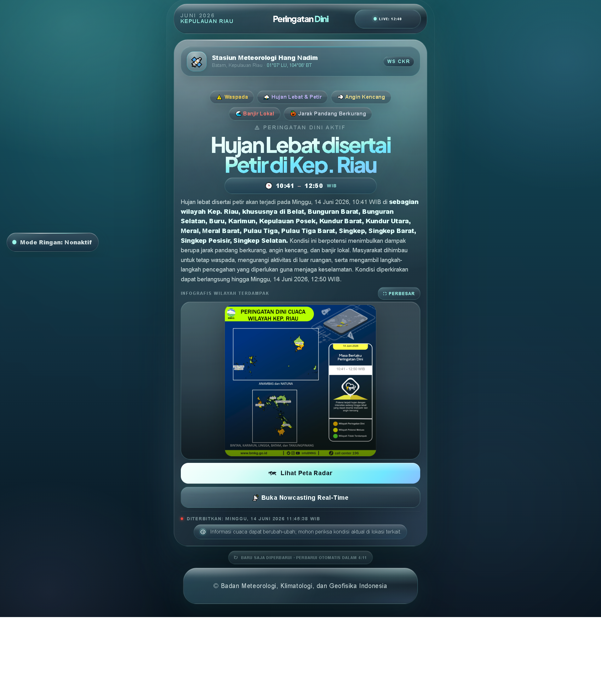
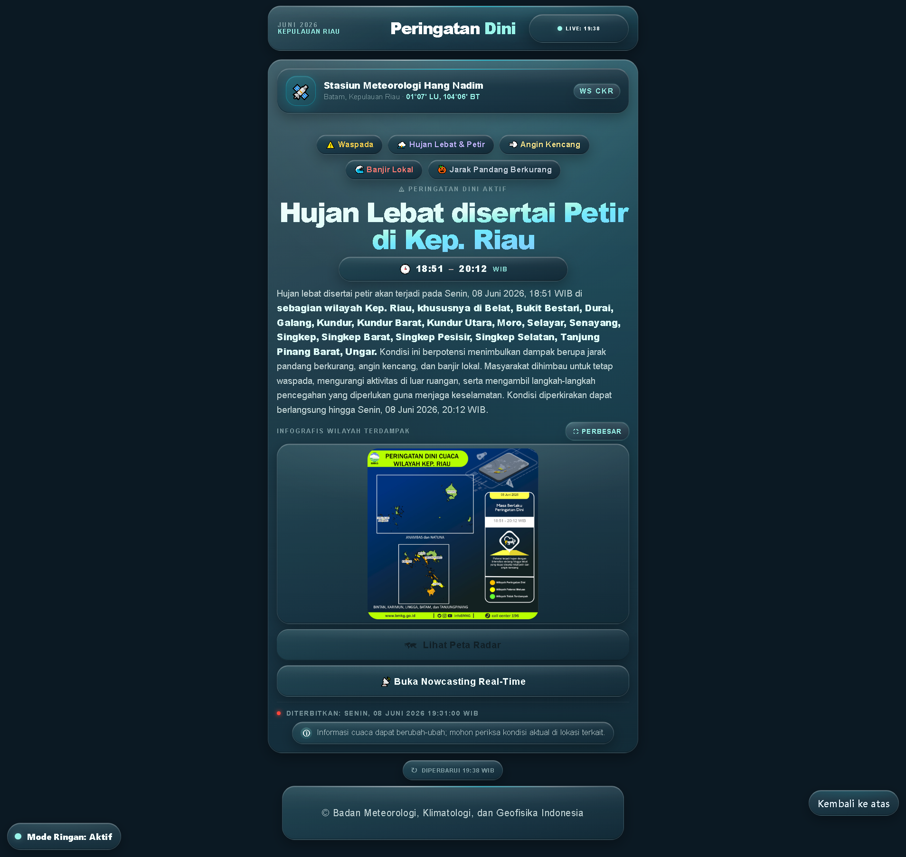
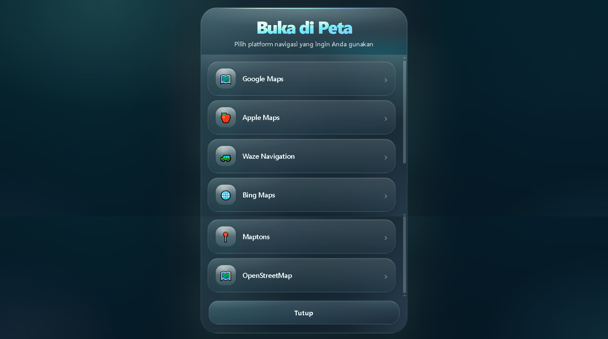
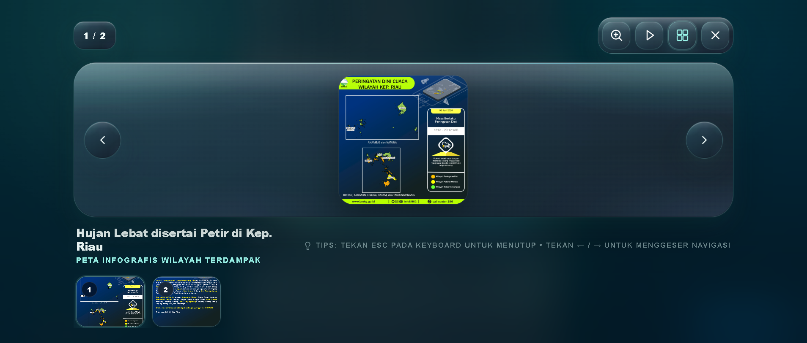
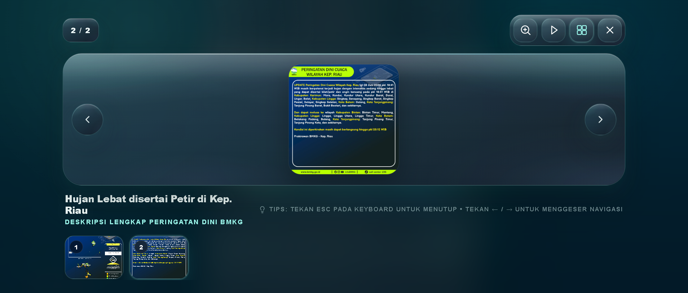
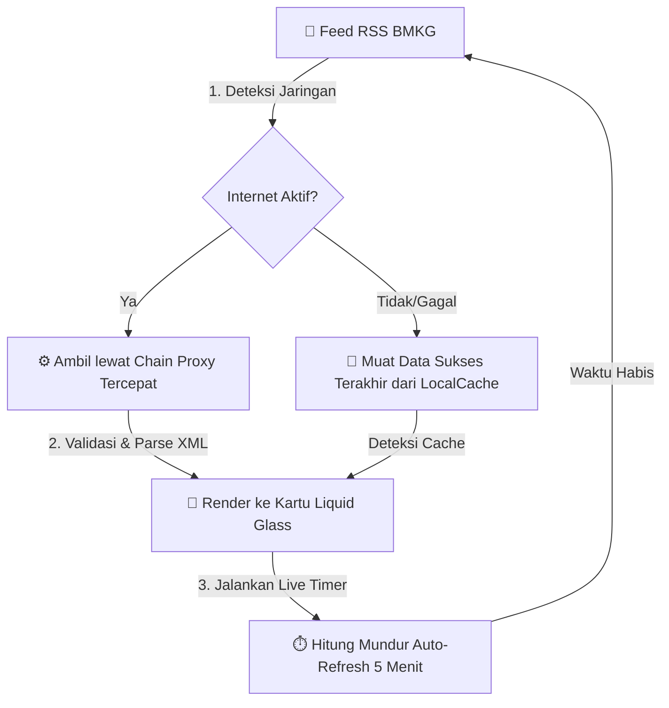

<div align="center">

# 🌩️ Peringatan Dini Cuaca BMKG — Kep. Riau

#### Pantau peringatan dini cuaca Kepulauan Riau secara real-time. Data resmi BMKG dengan desain Liquid Glass khas iOS yang bersih, ringan, dan cepat! 🌩️⚡

<br/>

[](https://github.com/peringatandinicuacakepri/peringatandinicuacakepri.github.io/stargazers)
&nbsp;
[](https://github.com/peringatandinicuacakepri/peringatandinicuacakepri.github.io/commits)
&nbsp;
[](LICENSE)

[](https://nowcasting.bmkg.go.id)
&nbsp;
[](https://peringatandinicuacakepri.github.io)
&nbsp;
[](https://pages.github.com)

<br/>

### 🌐 [Buka Website](https://peringatandinicuacakepri.github.io) &nbsp;•&nbsp; [✨ Fitur Unggulan](#-fitur-unggulan) &nbsp;•&nbsp; [📸 Tampilan](#-tampilan) &nbsp;•&nbsp; [🛟 FAQ & Bantuan](#-faq--bantuan) &nbsp;•&nbsp; [📊 Sumber Data](#-sumber-data)

</div>


## 👋 Sekilas Proyek

Halo! Proyek ini saya kembangkan agar mempermudah siapa saja untuk memantau informasi peringatan dini cuaca ekstrem di wilayah **Kepulauan Riau** secara real-time. Daripada harus membuka beberapa halaman web BMKG yang terpisah hanya untuk mengetahui kondisi hari ini, seluruh data penting sekarang saya ringkas di satu layar interaktif yang cantik dan responsif.

Data diambil langsung dari server resmi BMKG (area pantauan **Stasiun Meteorologi Hang Nadim, Batam**), sehingga info yang Anda baca selalu akurat. Halaman ini dirancang sangat ringan agar performanya tetap stabil dan lancar, bahkan pada perangkat mobile lama dengan spesifikasi rendah.


## 📸 Tampilan Dashboard

<div align="center">

| 💎 Mode Full (Efek Aurora & Glow) | 🍃 Mode Ringan (Hemat Daya & Cepat) |
|:---:|:---:|
|  |  |
| *Visual premium dengan efek Liquid Glass penuh* | *Efek statis hemat daya untuk performa kilat* |

<br/>

**🧭 Terintegrasi dengan Aplikasi Navigasi Favoritmu**



<br/>

**🔎 Peta Infografis Interaktif (Bisa Zoom & Digeser)**

| Zoom & Geser Gambar Bebas | Teks Ringkasan Slide Otomatis |
|:---:|:---:|
|  |  |

</div>


## ✨ Fitur Unggulan

*   🌦️ **Peringatan Dini Real-Time BMKG:** Data langsung bersumber dari feed XML Nowcasting BMKG untuk prakiraan cuaca 0 hingga 6 jam ke depan.
*   ⏱️ **Timer Penyegaran & Kesegaran Data Dinamis:** Dilengkapi indikator kesegaran data (*"Baru saja diperbarui"* / *"Diperbarui X menit yang lalu"*) serta hitung mundur penyegaran otomatis (*"Perbarui otomatis dalam X:XX"*) yang berdetak real-time setiap detik.
*   🔌 **Keandalan Mode Offline:** Jika jaringan terputus atau seluruh proxy gagal, aplikasi secara cerdas memuat data sukses terakhir dari memori lokal (`localStorage`) dan menandainya dengan badge luring khusus.
*   🌗 **Dua Mode Performa Pintar:**
    *   **Mode Full:** Efek kaca buram premium, animasi bayangan mengalir (*ambient glow*), dan transisi halus.
    *   **Mode Ringan:** Menghilangkan efek blur dan animasi berat untuk menghemat daya baterai dan memori RAM perangkat *low-end*.
*   🔍 **Lightbox Infografis Canggih:** Peta infografis cuaca dari BMKG bisa diklik untuk diperbesar, digeser dengan navigasi panah, di-zoom menggunakan roda mouse atau sentuhan, dan ditutup dengan tombol `ESC` (kini aktif penuh juga di Mode Ringan!).
*   🧭 **Integrasi Pintar Peta Navigasi:** Koordinat stasiun meteorologi dapat dibuka langsung di aplikasi peta pilihan Anda seperti Google Maps, Apple Maps, Waze, OpenStreetMap, dsb.
*   📱 **Optimalisasi Mobile UX & Gestur:** Dilengkapi gestur tarik ke bawah (*Pull-to-Refresh*) untuk menyegarkan data dengan mudah serta dimensi tinggi modal yang adaptif (`80dvh`) agar pas di segala jenis layar HP.
*   ♿ **Ramah Aksesibilitas (WCAG AA Compliant):** Memakai tautan pintas *"Skip-to-Main Content"* untuk navigasi keyboard, struktur hierarki heading `h2` yang semantik, atribut deskriptif `aria-label`, serta kontras warna teks yang dioptimalkan.
*   📄 **Lisensi GNU GPL v3:** Proyek ini dilisensikan di bawah ketentuan lisensi GNU GPL v3 untuk menjamin kode sumber tetap terbuka, bebas dikembangkan, dan aman secara hukum untuk semua orang.


## ⚙️ Alur Kerja Sistem



1.  **Pemuatan Data:** Sistem memeriksa status jaringan Anda. Jika Anda sedang online, aplikasi menarik feed peringatan dini (RSS) terbaru dari BMKG melalui 5 jalur proxy berurutan (untuk menjamin bypass CORS yang andal).
2.  **Pemulihan Mandiri (Offline):** Jika koneksi internet mati atau server BMKG melambat, sistem secara otomatis mengambil dan menyajikan data dari penyimpanan cache lokal di browser Anda.
3.  **Tampilan:** Teks diolah menjadi kartu informasi yang rapi, dan infografis wilayah dipetakan ke dalam lightbox interaktif.
4.  **Auto-Refresh:** Timer dinamis menghitung mundur waktu pembaruan berikutnya dan menyegarkan data secara otomatis di latar belakang.


## 🚀 Jalankan Secara Lokal

Karena proyek ini dibangun murni menggunakan teknologi web standar tanpa ada proses kompilasi (*no build steps*), Anda bisa langsung menjalankannya di komputer Anda dalam hitungan detik!

1.  **Clone repositori ini:**
    ```bash
    git clone https://github.com/peringatandinicuacakepri/peringatandinicuacakepri.github.io.git
    cd peringatandinicuacakepri.github.io
    ```
2.  **Buka file index.html:**
    *   Cukup klik ganda berkas `index.html` untuk langsung membukanya di browser favorit Anda!
    *   Atau jalankan server lokal ringan menggunakan Python jika Anda ingin mengujinya di jaringan lokal:
        ```bash
        python -m http.server 8000
        ```
        Lalu buka `http://localhost:8000` pada browser Anda.


## 🛟 FAQ & Bantuan

<details>
<summary><b>Apakah ini aplikasi resmi buatan BMKG?</b></summary><br/>
Bukan. Ini adalah proyek personal independen yang merapikan dan menyajikan ulang data terbuka milik BMKG agar lebih nyaman dibaca publik. Untuk acuan hukum dan info paling resmi, Anda harus tetap merujuk langsung ke situs <a href="https://www.bmkg.go.id">bmkg.go.id</a>.
</details>

<details>
<summary><b>Apakah saya memerlukan kunci API (API Key) untuk menjalankan proyek ini?</b></summary><br/>
Sama sekali tidak! Berbeda dengan layanan data cuaca luar negeri (seperti OpenWeatherMap) yang mengharuskan Anda mendaftar dan menyisipkan API Key rahasia ke dalam kode, proyek ini menggunakan data terbuka nasional (*Open Data*) yang disediakan secara cuma-cuma oleh BMKG Indonesia tanpa perlu registrasi apa pun.
</details>

<details>
<summary><b>Bagaimana jika browser saya memblokir gambar karena isu "Mixed Content"?</b></summary><br/>
Tidak perlu khawatir. Beberapa gambar orisinal dari server BMKG disajikan melalui protokol HTTP tidak aman. Kode JavaScript kami telah dilengkapi penyeimbang protokol otomatis yang akan mengubah tautan `http://` menjadi `https://` secara dinamis demi menghindari pemblokiran *Mixed Content* dan menjaga gembok HTTPS di situs web Anda tetap hijau aman!
</details>

<details>
<summary><b>Seberapa sering data diperbarui?</b></summary><br/>
Sistem akan memeriksa dan memperbarui data secara otomatis setiap 5 menit sekali. Anda juga bisa menarik layar ke bawah (Pull-to-Refresh) pada HP atau menekan tombol coba lagi jika ingin memperbarui secara instan.
</details>

<details>
<summary><b>Bagaimana jika saya membuka berkas index.html secara lokal tanpa server?</b></summary><br/>
Sistem kami telah dilengkapi pengaman cerdas! Jika berkas dijalankan langsung lewat protokol lokal (`file://`), aplikasi akan otomatis mendeteksi hal tersebut, melewati jalur direct fetch untuk menghindari eror CORS merah di konsol, dan langsung mengalihkan request lewat proxy yang aman.
</details>

<details>
<summary><b>Mengapa infografis wilayah kadang-kadang tidak muncul?</b></summary><br/>
Gambar infografis wilayah dikirimkan langsung oleh prakirawan BMKG di stasiun setempat. Jika cuaca terpantau aman dan kondusif, BMKG tidak menerbitkan infografis baru, sehingga aplikasi akan menampilkan kartu penanda kondisi aman secara otomatis.
</details>

<details>
<summary><b>Apa perbedaan utama Mode Full dan Mode Ringan?</b></summary><br/>
Mode Full menyajikan visual penuh yang mewah (blur transparan, gradien dinamis, aurora, dan animasi halus). Mode Ringan menyederhanakan visual dengan mematikan efek blur filter dan animasi guna menghemat konsumsi daya baterai dan beban RAM pada HP spek rendah (low-end).
</details>

<details>
<summary><b>Apakah stasiun radar Hang Nadim bisa offline atau dalam pemeliharaan (maintenance)?</b></summary><br/>
Bisa terjadi. Jika stasiun radar di Batam mengalami gangguan teknis atau mati daya sementara, server BMKG tidak akan merilis gambar radar baru. Dalam kondisi ini, sistem kami akan mendeteksi tidak adanya pembaruan, menampilkan data sukses terakhir dari cache local, dan memberikan label penanda offline agar info di layar tidak mendadak kosong.
</details>

<details>
<summary><b>Apakah aplikasi ini menguras kuota internet atau baterai smartphone?</b></summary><br/>
Sangat hemat! Pada Mode Ringan, semua proses rendering berat (efek blur dinamis, filter, dan transisi animasi) dinonaktifkan sepenuhnya. Data XML cuaca yang ditarik berukuran sangat kecil (hanya beberapa kilobyte), sehingga sangat ramah kuota data internet Anda dan tidak membuat ponsel menjadi panas.
</details>

<details>
<summary><b>Mengapa aplikasi ini menunjukkan koordinat stasiun, apakah melacak GPS saya?</b></summary><br/>
Sama sekali tidak. Kami sangat menjaga privasi Anda—aplikasi ini tidak memerlukan atau melacak posisi GPS Anda. Koordinat stasiun meteorologi (`1.119590, 104.113316`) yang tertera di aplikasi adalah koordinat statis (fisik) lokasi Stasiun Meteorologi Hang Nadim, Batam, yang disajikan murni sebagai referensi navigasi peta Anda.
</details>

<details>
<summary><b>Bisakah saya menyematkan (embed) dashboard ini di website saya sendiri?</b></summary><br/>
Tentu saja! Berkat lisensi terbuka GNU GPL v3, Anda bebas menyematkan dashboard ini menggunakan tag `<iframe>` di blog/website Anda, atau meng-cloning repositori ini secara gratis untuk di-hosting pada domain Anda sendiri. Jangan lupa untuk tetap menyertakan kredit ke proyek aslinya, ya!
</details>

<details>
<summary><b>Bagaimana alur kerja sistem 'Chain Proxy' pada aplikasi ini?</b></summary><br/>
Karena aturan keamanan browser membatasi penarikan data lintas domain secara langsung (CORS), kami membangun sistem rantai proxy (Proxy Chain). Jika proxy pertama lambat merespons atau mati, aplikasi otomatis berpindah ke proxy kedua, ketiga, dan seterusnya dalam hitungan milidetik tanpa intervensi manual.
</details>

<details>
<summary><b>Apakah ada rencana pengembangan dashboard cuaca untuk wilayah lain?</b></summary><br/>
Saat ini, proyek difokuskan khusus untuk Kepulauan Riau (pantauan Batam). Namun, karena basis kodenya modular dan berlisensi terbuka, Anda dipersilakan meng-cloning repositori ini dan mengubah parameter kode stasiun (misal dari stasiun CKR ke stasiun lain) serta mengubah koordinat peta sesuai wilayah tempat tinggal Anda!
</details>


## 📊 Sumber Referensi Data

| Penyedia | Deskripsi Data | Tautan Resmi |
|:---|:---|:---|
| **BMKG Nowcast API** | Sumber utama data peringatan dini cuaca wilayah Kepri (nowcasting 0-6 jam) | [Nowcast BMKG](https://nowcasting.bmkg.go.id/nowcast) |
| **BMKG Alerts RSS** | Feed XML peringatan dini cuaca nasional | [Alerts RSS](https://www.bmkg.go.id/alerts/nowcast/id/rss.xml) |
| **BMKG Infografis** | Gambar infografis area pantauan Stasiun Meteorologi Hang Nadim (Batam) | [Infografis CKR](https://nowcasting.bmkg.go.id/infografis/) |
| **Google Fonts** | Sumber penyedia tipografi modern (*Plus Jakarta Sans*) | [Google Fonts](https://fonts.google.com) |
| **AllOrigins & CORS Proxy** | Layanan proxy publik untuk melewati batasan CORS pada request browser | [AllOrigins](https://allorigins.win) / [CORSProxy](https://corsproxy.io) |

*Koordinat acuan stasiun meteorologi utama terletak di Batam, Kepulauan Riau (`1.119590, 104.113316`).*

> ⚠️ **Hak Cipta Data:** Seluruh data cuaca dan peta infografis adalah hak cipta milik **Badan Meteorologi, Klimatologi, dan Geofisika (BMKG) Indonesia**. Aplikasi ini hanya menyajikan ulang data publik tersebut secara non-komersial.


## 🛠️ Teknologi yang Digunakan

<div align="center">


&nbsp;

&nbsp;


</div>

Proyek ini dibangun murni menggunakan **HTML5**, **CSS3**, dan **JavaScript Modern ES6** polos (*Vanilla JS*) tanpa ketergantungan pada pustaka pihak ketiga (*no frameworks*), menjamin waktu pemuatan halaman yang sangat gegas.


## 🤝 Kontribusi & Dukungan

Menemukan kesalahan data, bug visual, atau memiliki usulan fitur menarik? Anda dipersilakan untuk membuka [Issues](https://github.com/peringatandinicuacakepri/peringatandinicuacakepri.github.io/issues) di repositori ini. Kontribusi dan ide kreatif Anda sangat berharga untuk pengembangan proyek ini ke depan!

Jika Anda merasa proyek ini bermanfaat, dukungan berupa sebuah bintang (⭐) pada repositori ini akan sangat memotivasi saya selaku pengembang. Terima kasih banyak atas dukungan Anda!

## ✉️ Hubungi Kami

Untuk saran, kolaborasi, atau pertanyaan lebih lanjut, Anda dapat menghubungi kami melalui [GitHub Issues](https://github.com/peringatandinicuacakepri/peringatandinicuacakepri.github.io/issues).


<div align="center">

Dibuat dengan ❤️ oleh **Jeremi Totti Manalu**  
*Berbagi informasi cuaca, menginspirasi keselamatan bersama.*

</div>
